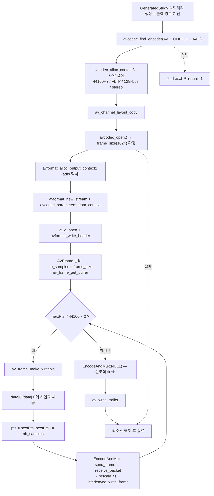

# 09. 오디오 인코딩 (AAC)

> 소스: `study-FFMPEG/09-encode-audio/main.c` · 타겟: `studyFFMPEG09EncodeAudio` · [← 트랙 개요](README.md)

## 학습 목표

440Hz 사인파 2초를 프로그램에서 직접 생성해 AAC로 인코딩한다. 비디오 인코딩(08)과 달리 오디오만이 가진 제약 — 인코더가 결정하는 고정 `frame_size`, planar float(`FLTP`) 샘플 포맷, FFmpeg 7.x의 `AVChannelLayout` 설정 방법 — 을 익힌다. 또한 raw AAC는 그대로 재생할 수 없으므로 "adts" 먹서로 ADTS 헤더를 붙이는 과정을 통해 컨테이너 쓰기(`avformat_write_header` / `av_write_trailer`)를 처음으로 맛본다.

## 핵심 개념

### 오디오 인코딩만의 규칙

- **frame_size는 인코더가 정한다**: 비디오는 프레임 단위가 자유롭지만, AAC는 한 프레임에 들어가는 샘플 수가 고정이다(보통 1024). `avcodec_open2()` 이후에 `pEncoderContext->frame_size`를 읽어 **그 크기로** `AVFrame`을 만들어야 한다. 실제 실행 시 이 값은 1024로 출력된다.
- **sample_fmt는 FLTP만**: FFmpeg 내장 AAC 인코더는 `AV_SAMPLE_FMT_FLTP`(planar float)만 받는다. planar이므로 `data[0]`이 왼쪽 채널, `data[1]`이 오른쪽 채널로 분리되어 있다.
- **AVChannelLayout은 copy 함수로**: FFmpeg 7.x에서 채널 레이아웃은 단순 대입이 아니라 `av_channel_layout_copy()`로 설정한다(내부에 동적 할당 멤버가 있을 수 있기 때문).

### pts 단위 설계 — time_base = 1/샘플레이트

`time_base`를 `{1, 44100}`으로 잡으면 pts의 단위가 "샘플 번호"가 된다. 프레임을 보낼 때마다 `nextPts += nb_samples`만 하면 되므로 타임스탬프 계산이 아주 단순해진다. 2초를 만들려면 `nextPts < 44100 × 2`가 될 때까지 반복하면 된다.

### 사인파 생성

각 샘플 값은 `0.3 × sin(위상)`으로 만든다. 진폭 0.3은 클리핑(포화)을 피하기 위함이고, 위상은 샘플마다 `2π × 440 / 44100`씩 증가시킨다. 440Hz는 표준 조율음 A4(라)다.

### ADTS 먹서 — 컨테이너 쓰기의 최소 형태

AAC 인코더가 내놓는 raw 패킷에는 샘플레이트/채널 같은 자기 서술 정보가 없어 그대로 파일에 쓰면 재생기가 해석하지 못한다. "adts" 먹서는 패킷마다 7바이트 ADTS 헤더를 붙여 스트리밍 가능한 `.aac` 파일을 만든다. 이때 컨테이너 쓰기의 표준 순서를 처음 경험한다:

| 단계 | API |
|---|---|
| 1. 출력 컨텍스트 생성 | `avformat_alloc_output_context2(..., "adts", ...)` |
| 2. 스트림 추가 | `avformat_new_stream()` |
| 3. 인코더 설정 → 스트림으로 복사 | `avcodec_parameters_from_context()` |
| 4. 파일 열기 | `avio_open()` |
| 5. 헤더 쓰기 | `avformat_write_header()` |
| 6. 패킷 쓰기 반복 | `av_interleaved_write_frame()` |
| 7. 트레일러 쓰기 | `av_write_trailer()` |

## 프로그램 흐름



## 핵심 API

| API / 구조체 | 역할 |
|---|---|
| `avcodec_find_encoder(AV_CODEC_ID_AAC)` | FFmpeg 내장 AAC 인코더를 찾는다 |
| `AVCodecContext->frame_size` | 인코더가 요구하는 프레임당 샘플 수. **open 이후**에 읽는다 |
| `AV_SAMPLE_FMT_FLTP` | planar float 샘플 포맷. 내장 AAC 인코더의 유일한 입력 포맷 |
| `av_channel_layout_copy()` | FFmpeg 7.x 방식의 채널 레이아웃 설정(대입 금지) |
| `avformat_alloc_output_context2()` | 출력 컨테이너(먹서) 컨텍스트 생성. 여기선 "adts" 지정 |
| `avformat_new_stream()` | 출력 컨테이너에 스트림을 추가한다 |
| `avcodec_parameters_from_context()` | **인코더 컨텍스트 → 스트림 codecpar** 방향 복사 |
| `avformat_write_header()` / `av_write_trailer()` | 컨테이너 헤더/트레일러 쓰기. 항상 쌍으로 호출 |
| `av_packet_rescale_ts()` | 인코더 time_base → 스트림 time_base로 pts/dts/duration 변환 |
| `av_interleaved_write_frame()` | 먹서를 통해 패킷을 파일에 쓴다(ADTS 헤더 자동 부착) |

## 이전 레슨과의 차이

- 08은 **비디오** 인코딩이었다. 비디오는 프레임 크기(해상도)를 우리가 정했지만, 오디오는 **인코더가 frame_size를 정하고 우리가 따라야 한다**. 샘플 포맷도 FLTP로 강제된다.
- 08은 인코딩된 패킷을 `fwrite()`로 raw 파일에 직접 썼지만, 이번에는 **처음으로 먹서(AVFormatContext 출력 모드)를 통해 쓴다**. `avformat_write_header` → `av_interleaved_write_frame` → `av_write_trailer`의 흐름은 10(리먹싱)·11(먹싱)에서 그대로 반복되는 뼈대다.
- 타임스탬프 관리도 다르다: 비디오는 `pts += 1`(프레임 번호)이었지만 오디오는 `pts += nb_samples`(샘플 번호)로 증가한다.

## ⚠️ 알아두기

- `avcodec_parameters_from_context()`는 10 레슨의 `avcodec_parameters_copy()`와 **복사 방향이 다르다**. 여기서는 "인코더 설정 → 스트림", 리먹싱에서는 "입력 스트림 → 출력 스트림"이다. 이름이 비슷해 혼동하기 쉽다.
- 인코딩이 끝나면 `EncodeAndMux(..., NULL, ...)`로 NULL 프레임을 보내 인코더 내부에 남은 패킷을 **flush**해야 한다. AAC 인코더는 내부 지연이 있어 flush 없이는 끝부분 소리가 잘린다.
- 실행 결과: 총 88개 패킷이 쓰인다 (44100×2 / 1024 = 86.1…개 프레임 + flush로 나오는 지연 패킷).

## 실행 방법

```bash
# 빌드 (저장소 루트에서)
cmake --build cmake-build-debug --target studyFFMPEG09EncodeAudio
# 실행 (빌드 트리 안에서 실행해야 리소스 경로 계산이 성공한다)
./cmake-build-debug/study-FFMPEG/09-encode-audio/studyFFMPEG09EncodeAudio
```

- 입력: 없음 (사인파를 코드에서 직접 생성)
- **출력: `resources/GeneratedStudy/study-encoded.aac`** — 2초 길이 440Hz 스테레오 톤, 88개 패킷
- 재생 확인: `ffplay resources/GeneratedStudy/study-encoded.aac`

---
→ 자세한 코드 해설: [코드 상세 해설](09-encode-audio-deep-dive.md)
