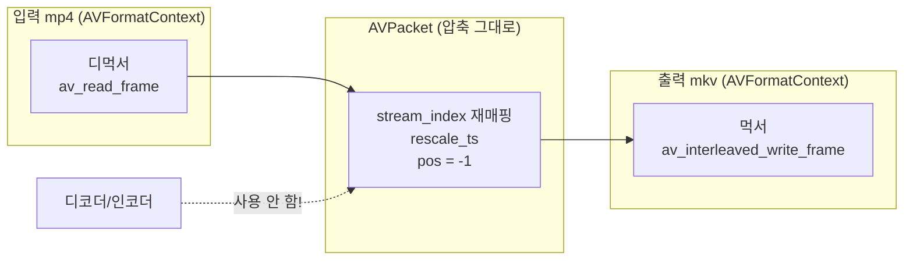

# 10. 리먹싱 (컨테이너 변환) — 코드 상세 해설

> [← 기본 문서](10-remuxing.md)

## 전체 구조

| 구간 | 하는 일 |
|---|---|
| `main` 입력부 | murage.mp4 열기 + 스트림 정보 채우기 |
| `main` 출력 준비 | 출력 컨텍스트(.mkv 추론) 생성 → 스트림 매핑 배열 → 스트림 복사 |
| `main` 쓰기부 | avio_open → 헤더 → 패킷 복사 루프 → 트레일러 |
| 패킷 복사 루프 | stream_index 재매핑 + rescale_ts + pos 리셋 + interleaved write |
| `EnsureGeneratedStudyDirectory()` / `GetResourcePath()` | 출력 디렉터리 생성 / 경로 계산 유틸 |

```text
main
 ├─ GetResourcePath("murage.mp4") / ("GeneratedStudy/study-remux.mkv")
 ├─ avformat_open_input / find_stream_info          ← 입력
 ├─ avformat_alloc_output_context2(NULL, NULL, .mkv) ← 출력 (확장자 추론)
 ├─ pStreamMapping = av_calloc(nb_streams)
 ├─ for (입력 스트림 순회)
 │    ├─ 비디오/오디오/자막 아니면 mapping = -1, continue
 │    └─ new_stream → avcodec_parameters_copy → codec_tag = 0
 ├─ avio_open → avformat_write_header
 ├─ while (av_read_frame >= 0)
 │    └─ 재매핑 → rescale_ts → pos = -1 → av_interleaved_write_frame
 ├─ av_write_trailer
 └─ ffmpeg_release: packet/mapping/avio/output/input 해제
```

인코더/디코더가 하나도 등장하지 않는 것이 이 레슨의 특징이다. `AVCodecContext` 없이 `AVFormatContext` 두 개(입력/출력)와 `AVPacket` 하나로 모든 일이 끝난다.

## 코드 블록별 해설

### 1. 입력 열기 — 늘 하던 골격

```c
/** ===== 입력 열기 ===== */
errorCode = avformat_open_input(&pInputContext, inputPath, NULL, NULL);
FFMPEG_ERROR(errorCode, "[FFMPEG ERROR] FFMPEG Open Failed...\r\n")

errorCode = avformat_find_stream_info(pInputContext, NULL);
```

01 레슨부터 반복해 온 패턴이다. `avformat_find_stream_info()`가 채워주는 각 스트림의 `codecpar`와 `time_base`가 이번 레슨의 재료가 된다.

### 2. 출력 컨텍스트 — 확장자로 포맷 추론

```c
/**
 * ===== 출력 컨텍스트 생성 =====
 * 포맷 이름을 NULL로 주면 파일 확장자(.mkv)로 컨테이너를 추론한다.
 */
errorCode = avformat_alloc_output_context2(&pOutputContext, NULL, NULL, outputPath);
...
printf("output format : %s\r\n", pOutputContext->oformat->name);
```

09에서는 세 번째 인자에 `"adts"`를 명시했지만, 여기서는 NULL을 주고 출력 경로의 `.mkv` 확장자로 matroska 먹서를 추론시킨다. 실행하면 `output format : matroska`가 출력된다. 출력 경로를 `.avi`나 `.ts`로만 바꿔도 다른 컨테이너로 리먹싱된다 — 코드 수정이 사실상 필요 없다는 점이 리먹싱의 매력이다.

### 3. 스트림 매핑 배열

```c
/** 입력 스트림 index → 출력 스트림 index 매핑 (복사 안 하는 스트림은 -1) */
int *pStreamMapping = NULL;
...
pStreamMapping = av_calloc(pInputContext->nb_streams, sizeof(int));
```

`av_calloc()`은 FFmpeg의 할당자로 0으로 초기화된 메모리를 준다. 입력 파일에 데이터 스트림(예: mp4의 timecode 트랙)이 섞여 있으면 입력 index와 출력 index가 어긋나므로 이 매핑 테이블이 필요하다. murage.mp4는 비디오+오디오 2개뿐이라 실제로는 0→0, 1→1의 항등 매핑이 되지만, 임의 입력에도 안전한 일반형 코드다.

### 4. 스트림 복사 — parameters_copy와 codec_tag

```c
for (int idx = 0; idx < (int) pInputContext->nb_streams; ++idx) {
    AVStream *pInputStream = pInputContext->streams[idx];
    AVStream *pOutputStream = NULL;
    enum AVMediaType mediaType = pInputStream->codecpar->codec_type;

    /** 비디오/오디오/자막만 복사하고 데이터 스트림 등은 건너뛴다 */
    if (mediaType != AVMEDIA_TYPE_VIDEO &&
        mediaType != AVMEDIA_TYPE_AUDIO &&
        mediaType != AVMEDIA_TYPE_SUBTITLE) {
        pStreamMapping[idx] = -1;
        continue;
    }

    pStreamMapping[idx] = outputStreamCount++;

    pOutputStream = avformat_new_stream(pOutputContext, NULL);
    ...
    errorCode = avcodec_parameters_copy(pOutputStream->codecpar, pInputStream->codecpar);
    ...
    pOutputStream->codecpar->codec_tag = 0;
}
```

- `avcodec_parameters_copy()`가 **"재인코딩 없음"의 핵심**이다. 코덱 종류, 해상도, 샘플레이트, 그리고 디코딩에 필수인 extradata(SPS/PPS 등)까지 스트림에서 스트림으로 그대로 복사한다. 새 컨테이너는 이 정보만으로 헤더를 구성할 수 있다.
- `codec_tag = 0`: FourCC는 컨테이너 종속적이다. mp4에서 복사해 온 `avc1` 같은 tag를 mkv에 그대로 넘기면 먹서가 검증에서 거부할 수 있어, 0으로 리셋해 mkv 먹서가 알아서 정하게 한다. 리먹싱 예제에서 빠지지 않는 한 줄이다.
- 출력 스트림의 `time_base`는 설정하지 않는다 — mkv 먹서가 `avformat_write_header()`에서 자기 표준 단위(`1/1000`)로 정한다. 그래서 뒤의 rescale이 필수가 된다.

### 5. 패킷 복사 루프 (핵심)

```c
/** ===== 패킷 복사 루프 ===== */
while (av_read_frame(pInputContext, pPacket) >= 0) {
    AVStream *pInputStream = NULL;
    AVStream *pOutputStream = NULL;

    if (pPacket->stream_index >= (int) pInputContext->nb_streams ||
        pStreamMapping[pPacket->stream_index] < 0) {
        av_packet_unref(pPacket);
        continue;
    }

    pInputStream = pInputContext->streams[pPacket->stream_index];
    pPacket->stream_index = pStreamMapping[pPacket->stream_index];
    pOutputStream = pOutputContext->streams[pPacket->stream_index];

    av_packet_rescale_ts(pPacket, pInputStream->time_base, pOutputStream->time_base);
    /** pos는 원본 파일 내 위치라 새 파일에선 의미가 없다 → 미정(-1)으로 */
    pPacket->pos = -1;

    errorCode = av_interleaved_write_frame(pOutputContext, pPacket);
    ...
    writtenPacketCount++;
}
```

한 패킷이 거치는 4단계:

| 단계 | 코드 | 이유 |
|---|---|---|
| 1. 필터링 | `pStreamMapping[...] < 0`이면 unref 후 continue | 복사 대상이 아닌 스트림 제외 |
| 2. 재매핑 | `stream_index = pStreamMapping[...]` | 출력 컨테이너의 스트림 번호로 교체 |
| 3. 시간 변환 | `av_packet_rescale_ts(입력 tb, 출력 tb)` | mp4(`1/12800` 등)와 mkv(`1/1000`)의 단위 차이 흡수 |
| 4. 위치 리셋 | `pos = -1` | 원본 파일의 바이트 오프셋은 새 파일에서 무의미 |

`av_packet_rescale_ts()`는 pts, dts, duration 세 값을 한 번에 변환하며 `AV_NOPTS_VALUE`는 건드리지 않는다. 이 한 줄이 빠지면 mkv의 밀리초 단위에 mp4의 큰 틱 값이 그대로 들어가 재생 시간이 완전히 어긋난다.

`av_interleaved_write_frame()`은 비디오/오디오 패킷이 dts 순서로 올바르게 섞이도록 내부 버퍼링을 해 준다. `av_read_frame()`이 이미 인터리빙된 순서로 주긴 하지만, 먹서 요구 조건(단조 증가 dts)을 라이브러리가 보장해 주므로 리먹싱에서는 관례적으로 이 함수를 쓴다. 참고로 이 함수는 성공 시 패킷 소유권을 가져가므로(내부에서 unref) 루프에서 별도 `av_packet_unref()`가 필요 없다 — 필터링으로 건너뛰는 경로에서만 직접 unref한다.

### 6. 트레일러와 해제

```c
/** 트레일러 쓰기 (mkv 인덱스 등 마무리 정보) */
errorCode = av_write_trailer(pOutputContext);
```

```c
exitStatus = 0;

ffmpeg_release:
av_packet_free(&pPacket);
av_freep(&pStreamMapping);
if (pOutputContext != NULL && pOutputContext->pb != NULL) {
    avio_closep(&pOutputContext->pb);
}
avformat_free_context(pOutputContext);
avformat_close_input(&pInputContext);
if (exitStatus == 0) {
    printf("Remuxing Done!\r\n");
} else {
    printf("Finished with error(s)...\r\n");
}
return exitStatus;
```

mkv는 트레일러 단계에서 SeekHead/Cues(탐색 인덱스)와 실제 duration을 기록하므로 `av_write_trailer()`를 빼먹으면 탐색이 안 되는 반쪽짜리 파일이 된다. 해제는 입력/출력의 방식 차이에 주목: 입력은 `avformat_close_input()` 하나로 끝나지만, 출력은 우리가 직접 연 `pb`를 `avio_closep()`로 닫은 뒤 `avformat_free_context()`를 따로 호출한다. `av_freep()`은 해제 후 포인터를 NULL로 만들어 주는 안전한 free다.

`exitStatus`는 `-1`로 시작해 성공 경로 끝에서만 `0`으로 바뀐다. 중간에 에러로 `goto ffmpeg_release`를 타면 `-1`인 채 0이 아닌 종료 코드로 끝나므로 셸/CI에서 실패를 감지할 수 있다.

## 심화: 리먹싱 데이터 흐름



일반 트랜스코딩은 `디먹서 → 디코더 → (필터) → 인코더 → 먹서`의 5단계지만 리먹싱은 가운데 3단계를 통째로 건너뛴다. murage.mp4(12.78초, 981패킷)의 리먹싱이 체감상 즉시 끝나는 이유다.

## ⚠️ 코드 특이점 상세

1. **출력 스트림의 time_base를 지정하지 않는다**
   `pOutputStream->time_base`를 건드리지 않고 먹서 결정에 맡긴다. `avformat_write_header()` 이후의 실제 값(mkv는 `1/1000`)을 rescale에서 사용하므로 문제없지만, 헤더 쓰기 **전에** 출력 time_base를 참조하는 코드를 추가하면 안 된다는 점은 기억해 둘 것.

2. **패킷 복사 루프의 unref 규칙이 두 갈래다**
   건너뛰는 경로는 명시적 `av_packet_unref()`, 쓰기 경로는 `av_interleaved_write_frame()`이 소유권을 가져가며 대신 정리한다. 두 경로를 혼동해 쓰기 후에 또 unref하거나, 건너뛰기에서 unref를 빼먹으면 각각 이중 해제/메모리 증가로 이어진다.

3. **쓰기 실패 시 `break`로 루프만 탈출**
   에러가 나도 `av_write_trailer()`는 호출된다. 불완전한 파일이라도 컨테이너 구조는 마무리하려는 의도로 볼 수 있다.

4. **`FFMPEG_ERROR` 매크로는 첫 번째 open에만 사용**
   매크로가 `return -1`을 포함해 goto 정리 루틴을 건너뛰기 때문에, 자원이 할당된 이후 구간에서는 `goto ffmpeg_release` 방식으로 통일했다. 첫 open 시점엔 해제할 자원이 없어 매크로를 써도 안전하다.
