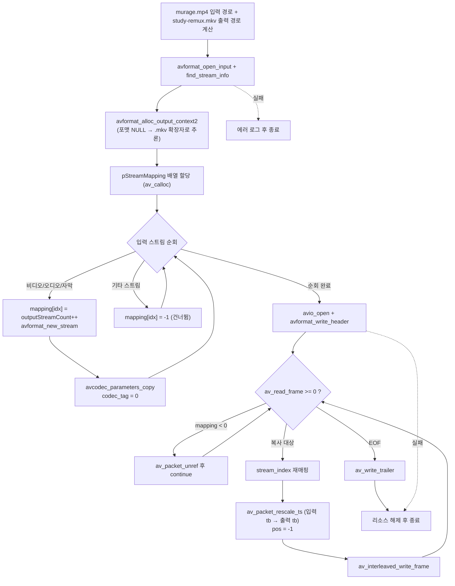

# 10. 리먹싱 (컨테이너 변환)

> 소스: `study-FFMPEG/10-remuxing/main.c` · 타겟: `studyFFMPEG10Remuxing` · [← 트랙 개요](README.md)

## 학습 목표

디코딩/인코딩 없이 압축 패킷을 그대로 다른 컨테이너로 옮기는 **리먹싱**을 구현한다(mp4 → mkv). `ffmpeg -i in.mp4 -c copy out.mkv`와 같은 동작으로, 화질 손실이 전혀 없고 매우 빠르다. 핵심은 코덱 파라미터 복사(`avcodec_parameters_copy`)와 컨테이너마다 다른 time_base 사이의 타임스탬프 변환(`av_packet_rescale_ts`)이다.

## 핵심 개념

### 리먹싱 = 그릇만 바꾸기

컨테이너(mp4/mkv)와 코덱(h264/aac)은 별개다. 리먹싱은 코덱 데이터(압축 패킷)는 건드리지 않고 **그릇만 바꾼다**. 따라서:

- 디코더/인코더가 전혀 필요 없다 — `AVCodecContext`를 만들지 않는다.
- 무손실이다 — 패킷 바이트가 1:1로 복사된다.
- 매우 빠르다 — CPU를 쓰는 곳이 사실상 타임스탬프 재계산뿐이다.

### 스트림 매핑

입력의 모든 스트림을 복사하는 게 아니라 비디오/오디오/자막만 복사하고 데이터 스트림 등은 건너뛴다. 이때 입력 스트림 index와 출력 스트림 index가 어긋날 수 있으므로, `pStreamMapping[입력 idx] = 출력 idx` 배열을 만들어 두고 (복사하지 않는 스트림은 `-1`) 패킷 복사 루프에서 `stream_index`를 바꿔치기한다.

### codec_tag = 0

`codec_tag`(FourCC)는 "이 컨테이너 안에서 이 코덱을 부르는 이름"이라 컨테이너마다 다르다(mp4의 `avc1` 등). 입력에서 복사해 온 tag를 그대로 두면 mkv 먹서가 "모르는 tag"라며 거부할 수 있으므로 `0`으로 초기화해 **새 컨테이너가 스스로 결정**하게 한다.

### 타임스탬프 변환 — 이 레슨의 진짜 핵심

컨테이너마다 time_base가 다르다. mp4는 `1/12800` 같은 단위, mkv는 `1/1000`(밀리초) 단위를 쓴다. pts/dts 숫자를 그대로 옮기면 재생 속도가 완전히 어긋나므로, 패킷마다 `av_packet_rescale_ts(pPacket, 입력 time_base, 출력 time_base)`로 pts/dts/duration을 모두 다시 계산한다. 또한 `pkt->pos`(원본 파일 내 바이트 위치)는 새 파일에서 의미가 없으므로 `-1`(미정)로 리셋한다.

## 프로그램 흐름



## 핵심 API

| API / 구조체 | 역할 |
|---|---|
| `avformat_alloc_output_context2()` | 출력 컨테이너 생성. 포맷 이름 NULL이면 파일 확장자(.mkv)로 추론 |
| `avformat_new_stream()` | 출력 컨테이너에 스트림을 추가한다 |
| `avcodec_parameters_copy()` | **입력 스트림 codecpar → 출력 스트림 codecpar** 복사. "재인코딩 없음"의 핵심 |
| `codecpar->codec_tag = 0` | FourCC를 리셋해 새 컨테이너가 자기 tag를 정하게 한다 |
| `av_calloc()` | 스트림 매핑 배열 할당(0으로 초기화) |
| `av_packet_rescale_ts()` | 입력 time_base → 출력 time_base로 pts/dts/duration 변환 |
| `AVPacket->pos = -1` | 원본 파일 내 위치 정보를 무효화(미정)한다 |
| `av_interleaved_write_frame()` | 스트림들이 dts 순서로 올바르게 섞이도록 버퍼링하며 쓴다 |
| `av_write_trailer()` | mkv 인덱스(Cues) 등 마무리 정보를 쓴다 |

## 이전 레슨과의 차이

- 09는 프레임을 **인코딩해서** 먹서로 보냈지만, 이번에는 **인코더도 디코더도 없다**. `av_read_frame()`으로 읽은 압축 패킷을 타임스탬프만 고쳐 바로 `av_interleaved_write_frame()`에 넘긴다. 09에서 배운 컨테이너 쓰기 골격(출력 컨텍스트 → 스트림 → 헤더 → 패킷 → 트레일러)은 그대로다.
- 파라미터 복사 함수가 다르다: 09는 `avcodec_parameters_from_context()`(인코더 → 스트림), 여기는 `avcodec_parameters_copy()`(입력 스트림 → 출력 스트림). **복사 방향과 출처가 다르므로** 함수 이름을 혼동하지 말 것.
- 입력과 출력을 동시에 다루는 첫 레슨이다: `AVFormatContext`가 입력용/출력용 두 개 존재한다.

## ⚠️ 알아두기

- 이 프로그램은 **재인코딩하지 않으므로** 출력 mkv의 화질/음질은 입력 mp4와 완전히 동일하다. ffprobe로 확인하면 코덱이 그대로(h264/aac)이고 duration도 12.778초로 유지된다.
- `av_packet_rescale_ts()`를 빼먹으면 파일은 만들어지지만 재생 속도가 어긋난다(mp4의 큰 pts 값이 mkv의 밀리초 단위로 그대로 해석되므로 수십 배 느려진 것처럼 보인다). 리먹싱 버그의 단골 원인이다.
- `codec_tag = 0`을 생략하면 조합에 따라 `avformat_write_header()`가 "codec tag not supported" 류의 에러로 실패할 수 있다.

## 실행 방법

```bash
# 빌드 (저장소 루트에서)
cmake --build cmake-build-debug --target studyFFMPEG10Remuxing
# 실행 (빌드 트리 안에서 실행해야 리소스 경로 계산이 성공한다)
./cmake-build-debug/study-FFMPEG/10-remuxing/studyFFMPEG10Remuxing
```

- 입력: `resources/murage.mp4` (12.78초, 비디오 383 + 오디오 598 패킷)
- **출력: `resources/GeneratedStudy/study-remux.mkv`** — 총 981개 패킷, 무손실·재인코딩 없음
- 확인: `ffprobe resources/GeneratedStudy/study-remux.mkv` → matroska, 12.778초

---
→ 자세한 코드 해설: [코드 상세 해설](10-remuxing-deep-dive.md)
