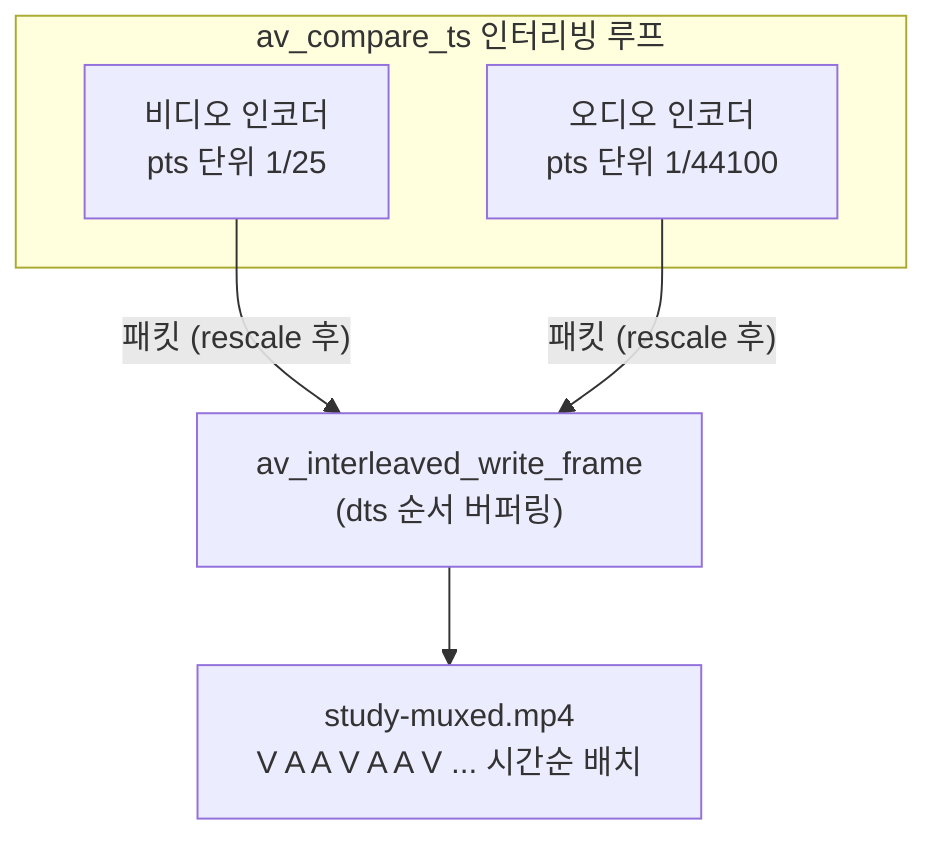

# 11. 먹싱 (비디오 + 오디오 → mp4) — 코드 상세 해설

> [← 기본 문서](11-muxing.md)

## 전체 구조

| 함수 | 하는 일 |
|---|---|
| `main` | 출력 컨텍스트 → 두 스트림 준비 → 헤더 → 인터리빙 루프 → 트레일러 → 해제 |
| `OpenVideoStream()` | libx264(없으면 MPEG-4) 인코더 + 비디오 스트림 + YUV420P 프레임 준비 |
| `OpenAudioStream()` | AAC 인코더 + 오디오 스트림 + FLTP 프레임(frame_size 크기) 준비 |
| `MakeNextVideoFrame()` | 움직이는 그라데이션 1프레임 생성. 5초 도달 시 false |
| `MakeNextAudioFrame()` | 사인파 1024샘플 생성. 5초 도달 시 false |
| `EncodeAndMux()` | send/receive 인코딩 + rescale + interleaved write (비디오/오디오 공용) |
| `CloseOutputStream()` | 스트림 세트(frame + encoder context) 해제 |

```text
main
 ├─ avformat_alloc_output_context2(.mp4 추론)
 ├─ OpenVideoStream / OpenAudioStream   ← 각각 08/09 레슨의 압축판
 ├─ avio_open → avformat_write_header
 ├─ while (!videoDone || !audioDone)
 │    ├─ av_compare_ts로 비디오/오디오 중 뒤처진 쪽 선택
 │    ├─ MakeNext*Frame 성공 → EncodeAndMux(프레임)
 │    └─ 실패(목표 길이 도달) → EncodeAndMux(NULL) flush → done 플래그
 ├─ av_write_trailer
 └─ ffmpeg_release: packet → 스트림 세트×2 → avio → format context
```

## 코드 블록별 해설

### 1. StudyOutputStream — 스트림 세트 구조체

```c
/** 출력 스트림 하나(인코더 + 스트림 + 재사용 프레임)를 묶은 구조체 */
typedef struct StudyOutputStream {
    AVStream *pStream;
    AVCodecContext *pEncoderContext;
    AVFrame *pFrame;
    /** 다음에 인코딩할 프레임의 pts (각 인코더 time_base 단위) */
    int64_t nextPts;
    /** 오디오 사인파 위상 */
    double sinePhase;
} StudyOutputStream;
```

FFmpeg 공식 muxing 예제의 `OutputStream` 패턴을 단순화한 것이다. 비디오와 오디오가 완전히 같은 구성(인코더 + 스트림 + 프레임 + pts 카운터)을 가지므로, 구조체 하나로 두 스트림을 대칭 처리할 수 있고 `EncodeAndMux()`/`CloseOutputStream()`도 공용 함수가 된다. `nextPts`의 단위가 스트림마다 다르다는 점(비디오: 프레임 번호, 오디오: 샘플 번호)이 뒤의 `av_compare_ts()` 사용을 이해하는 열쇠다.

### 2. OpenVideoStream — 인코더 fallback과 GLOBAL_HEADER

```c
pEncoder = avcodec_find_encoder_by_name("libx264");
if (pEncoder == NULL) {
    printf("libx264 not found → fallback to MPEG-4 encoder\r\n");
    pEncoder = avcodec_find_encoder(AV_CODEC_ID_MPEG4);
}
```

`avcodec_find_encoder_by_name()`은 특정 구현체를 지정한다(H.264 인코더는 libx264, openh264, 하드웨어 인코더 등 여러 개일 수 있다). 이 저장소의 vcpkg ffmpeg에는 libx264가 빠져 있어 **항상 MPEG-4 fallback 경로를 탄다**.

```c
pVideoStream->pEncoderContext->width = VIDEO_WIDTH;
pVideoStream->pEncoderContext->height = VIDEO_HEIGHT;
pVideoStream->pEncoderContext->pix_fmt = AV_PIX_FMT_YUV420P;
pVideoStream->pEncoderContext->time_base = (AVRational) {1, VIDEO_FPS};
pVideoStream->pEncoderContext->framerate = (AVRational) {VIDEO_FPS, 1};
pVideoStream->pEncoderContext->bit_rate = 1000000;
pVideoStream->pEncoderContext->gop_size = 25;

if (strcmp(pEncoder->name, "libx264") == 0) {
    av_opt_set(pVideoStream->pEncoderContext->priv_data, "preset", "fast", 0);
}
```

08 레슨과 같은 설정이다. `time_base = {1, 25}`이므로 비디오 pts 1 = 1/25초 = 프레임 1장. `gop_size = 25`는 1초마다 키프레임(I-프레임)을 넣으라는 뜻이다. `av_opt_set()`은 인코더별 전용 옵션(`priv_data`)을 문자열로 설정하는 통로로, libx264일 때만 적용한다.

```c
/**
 * mp4는 코덱 설정(SPS/PPS)을 패킷이 아니라 컨테이너 헤더에 저장한다.
 * 이런 컨테이너에서는 인코더에 GLOBAL_HEADER 플래그를 꼭 줘야 한다.
 */
if (pOutputContext->oformat->flags & AVFMT_GLOBALHEADER) {
    pVideoStream->pEncoderContext->flags |= AV_CODEC_FLAG_GLOBAL_HEADER;
}
```

이 레슨의 새 개념이다. 플래그를 받은 인코더는 설정 데이터를 각 패킷에 반복 삽입하는 대신 `extradata`로 분리해 두고, 그 extradata가 `avcodec_parameters_from_context()`를 타고 스트림 codecpar → mp4 헤더(moov)로 들어간다. **`avcodec_open2()` 전에** 설정해야 효과가 있다.

```c
errorCode = avcodec_open2(pVideoStream->pEncoderContext, pEncoder, NULL);
...
pVideoStream->pStream = avformat_new_stream(pOutputContext, NULL);
...
errorCode = avcodec_parameters_from_context(pVideoStream->pStream->codecpar, pVideoStream->pEncoderContext);
...
pVideoStream->pStream->time_base = pVideoStream->pEncoderContext->time_base;
```

`인코더 open → 스트림 생성 → 파라미터 복사` 순서가 중요하다. open 이후에 복사해야 인코더가 만든 extradata까지 함께 넘어간다. 마지막으로 YUV420P 640×360 프레임을 `av_frame_get_buffer()`로 할당해 매 프레임 재사용한다.

### 3. OpenAudioStream — 09 레슨의 압축판

```c
pAudioStream->pEncoderContext->sample_rate = AUDIO_SAMPLE_RATE;
pAudioStream->pEncoderContext->sample_fmt = AV_SAMPLE_FMT_FLTP;
pAudioStream->pEncoderContext->bit_rate = 128000;
pAudioStream->pEncoderContext->time_base = (AVRational) {1, AUDIO_SAMPLE_RATE};
if (av_channel_layout_copy(&pAudioStream->pEncoderContext->ch_layout, &stereoLayout) < 0) {
    return false;
}

if (pOutputContext->oformat->flags & AVFMT_GLOBALHEADER) {
    pAudioStream->pEncoderContext->flags |= AV_CODEC_FLAG_GLOBAL_HEADER;
}
```

09와 동일한 AAC 설정에 GLOBAL_HEADER 처리만 추가됐다. AAC도 mp4에서는 AudioSpecificConfig를 글로벌 헤더에 넣으므로 비디오와 똑같이 플래그가 필요하다. 프레임도 09처럼 open 후 확정되는 `frame_size`(1024)에 맞춰 할당한다:

```c
pAudioStream->pFrame->nb_samples = pAudioStream->pEncoderContext->frame_size;
```

### 4. 인터리빙 인코딩 루프 (핵심)

```c
/**
 * ===== 인터리빙 인코딩 루프 =====
 * 비디오와 오디오 중 "다음 pts가 더 이른 쪽"을 먼저 인코딩한다.
 * av_compare_ts는 서로 다른 time_base의 타임스탬프를 비교해 준다.
 * (비디오 pts는 1/25초 단위, 오디오 pts는 1/44100초 단위)
 */
while (!videoDone || !audioDone) {
    bool encodeVideoNext;

    if (videoDone) {
        encodeVideoNext = false;
    } else if (audioDone) {
        encodeVideoNext = true;
    } else {
        encodeVideoNext = av_compare_ts(videoStream.nextPts, videoStream.pEncoderContext->time_base,
                                        audioStream.nextPts, audioStream.pEncoderContext->time_base) <= 0;
    }

    if (encodeVideoNext) {
        if (MakeNextVideoFrame(&videoStream)) {
            writtenPacketCount += EncodeAndMux(&videoStream, pOutputContext, videoStream.pFrame, pPacket);
        } else {
            /** 목표 길이 도달 → 인코더 flush 후 이 스트림은 종료 */
            writtenPacketCount += EncodeAndMux(&videoStream, pOutputContext, NULL, pPacket);
            videoDone = true;
        }
    } else {
        if (MakeNextAudioFrame(&audioStream)) {
            writtenPacketCount += EncodeAndMux(&audioStream, pOutputContext, audioStream.pFrame, pPacket);
        } else {
            writtenPacketCount += EncodeAndMux(&audioStream, pOutputContext, NULL, pPacket);
            audioDone = true;
        }
    }
}
```

- `av_compare_ts(a, tb_a, b, tb_b)`는 내부적으로 두 타임스탬프를 공통 단위로 환산해 비교한다. 예를 들어 비디오 nextPts=25(`1/25`초 단위, 즉 1.0초)와 오디오 nextPts=43008(`1/44100`초 단위, 즉 0.975초)를 비교하면 오디오가 더 이르므로 1을 반환하고 오디오 차례가 된다.
- 항상 **뒤처진 스트림을 먼저** 인코딩하므로 두 스트림의 진행 시각이 한 프레임 이상 벌어지지 않고, 결과적으로 파일 안에 비디오/오디오 패킷이 시간순으로 촘촘히 섞인다. 스트리밍 재생 시 버퍼링을 최소화하는 mp4의 이상적인 배치다.
- 한쪽이 끝나면(`videoDone`/`audioDone`) 비교를 생략하고 남은 쪽만 계속 인코딩한다.
- flush도 스트림별이다: `MakeNext*Frame()`이 false를 반환하는 순간 그 스트림의 인코더에만 NULL을 보내고 done으로 표시한다. 09에서는 flush가 루프 밖 한 줄이었지만, 스트림이 둘이 되면 이렇게 종료 시점이 갈라진다.

### 5. MakeNextVideoFrame — 길이 검사와 합성

```c
/** 목표 길이(초) 도달 검사: pts(1/25초 단위)가 5초를 넘으면 종료 */
if (av_compare_ts(pVideoStream->nextPts, pVideoStream->pEncoderContext->time_base,
                  OUTPUT_DURATION_SEC, (AVRational) {1, 1}) >= 0) {
    return false;
}

if (av_frame_make_writable(pFrame) < 0) {
    return false;
}

/** 08 레슨과 같은 움직이는 그라데이션 합성 */
for (int y = 0; y < pFrame->height; ++y) {
    for (int x = 0; x < pFrame->width; ++x) {
        pFrame->data[0][y * pFrame->linesize[0] + x] = (uint8_t) (x + y + frameIdx * 3);
    }
}
...
pFrame->pts = pVideoStream->nextPts;
pVideoStream->nextPts += 1;
```

- 종료 검사에도 `av_compare_ts()`를 쓴다. `OUTPUT_DURATION_SEC`(5)를 `{1,1}`(초 단위) time_base와 함께 넘겨 "nextPts가 5.0초 이상인가?"를 단위 걱정 없이 판정한다. 125프레임(5초 × 25fps)을 만들고 종료된다.
- `av_frame_make_writable()`: 인코더가 아직 이전 프레임 버퍼를 참조 중이면 복사본을 만들어 준다. 프레임 재사용 루프의 필수 관례.
- Y 평면은 `x + y + frameIdx*3`, U/V 평면(반해상도)은 각각 `128 + y + frameIdx*2` / `64 + x + frameIdx*5`로 채워 프레임마다 색이 흐르는 그라데이션이 된다. `linesize`(stride)로 행을 계산하는 것도 08과 같다.
- 비디오 pts는 `+= 1` — time_base가 `1/25`이므로 pts 1이 곧 프레임 1장이다.

### 6. MakeNextAudioFrame — 09와 같은 사인파

```c
for (int sampleIdx = 0; sampleIdx < pFrame->nb_samples; ++sampleIdx) {
    float sampleValue = (float) (0.3 * sin(pAudioStream->sinePhase));
    ((float *) pFrame->data[0])[sampleIdx] = sampleValue;
    ((float *) pFrame->data[1])[sampleIdx] = sampleValue;
    pAudioStream->sinePhase += 2.0 * M_PI * SINE_FREQUENCY / AUDIO_SAMPLE_RATE;
}

pFrame->pts = pAudioStream->nextPts;
pAudioStream->nextPts += pFrame->nb_samples;
```

09와 동일한 사인파 생성이지만, 위상을 지역 변수가 아닌 `pAudioStream->sinePhase`에 누적한다는 점만 다르다(구조체가 스트림 상태를 소유). 오디오 pts는 `+= nb_samples`(1024)로 증가한다 — 같은 "1 프레임"이라도 비디오와 오디오의 pts 증가폭이 이렇게 다르기 때문에 `av_compare_ts()`가 필요한 것이다.

### 7. EncodeAndMux — 두 스트림 공용 파이프라인

```c
int EncodeAndMux(StudyOutputStream *pOutputStream, AVFormatContext *pOutputContext,
                 AVFrame *pFrame, AVPacket *pPacket) {
    ...
    errorCode = avcodec_send_frame(pOutputStream->pEncoderContext, pFrame);
    ...
    while (errorCode >= 0) {
        errorCode = avcodec_receive_packet(pOutputStream->pEncoderContext, pPacket);
        if (errorCode == AVERROR(EAGAIN) || errorCode == AVERROR_EOF) {
            break;
        }
        ...
        /** 인코더 time_base → 스트림 time_base (mp4 먹서가 스트림 tb를 조정했을 수 있다) */
        av_packet_rescale_ts(pPacket, pOutputStream->pEncoderContext->time_base,
                             pOutputStream->pStream->time_base);
        pPacket->stream_index = pOutputStream->pStream->index;

        errorCode = av_interleaved_write_frame(pOutputContext, pPacket);
        ...
        writtenCount++;
    }

    return writtenCount;
}
```

09의 `EncodeAndMux()`와 구조가 같지만 인자가 `StudyOutputStream*`로 바뀌어 비디오/오디오가 **같은 함수**를 쓴다. 두 가지가 특히 중요하다:

- `av_packet_rescale_ts()`: mp4 먹서는 `avformat_write_header()`에서 스트림 time_base를 자기 단위로 바꿔놓을 수 있다(예: 비디오 `1/25` → `1/12800`). 인코더 단위 그대로 쓰면 재생 속도가 어긋나므로 반드시 변환한다.
- `pPacket->stream_index = pStream->index`: 스트림이 둘이므로 이 줄이 없으면 두 인코더의 패킷이 모두 0번 스트림으로 들어가 파일이 망가진다. 단일 스트림이던 09에서는 사실상 장식이었지만 여기서는 필수다.

`av_interleaved_write_frame()`은 dts 순서 보장을 위해 내부 버퍼링을 한다. 메인 루프의 `av_compare_ts()`가 이미 대체로 시간순으로 패킷을 만들지만, 인코더 지연(B-프레임, AAC lookahead)으로 생기는 미세한 순서 뒤틀림을 먹서 레벨에서 한 번 더 바로잡아 주는 이중 안전장치다.

### 8. 트레일러와 해제

```c
errorCode = av_write_trailer(pOutputContext);
```

```c
void CloseOutputStream(StudyOutputStream *pOutputStream) {
    av_frame_free(&pOutputStream->pFrame);
    avcodec_free_context(&pOutputStream->pEncoderContext);
}
```

```c
exitStatus = 0;

ffmpeg_release:
av_packet_free(&pPacket);
CloseOutputStream(&videoStream);
CloseOutputStream(&audioStream);
if (pOutputContext != NULL && pOutputContext->pb != NULL) {
    avio_closep(&pOutputContext->pb);
}
avformat_free_context(pOutputContext);
if (exitStatus == 0) {
    printf("Muxing Done!\r\n");
} else {
    printf("Finished with error(s)...\r\n");
}
return exitStatus;
```

mp4는 트레일러 단계에서 moov 박스(전체 인덱스)를 기록하므로 `av_write_trailer()` 없이는 대부분의 재생기가 파일을 열지 못한다. `AVStream`은 `avformat_free_context()`가 함께 해제하므로 `CloseOutputStream()`은 프레임과 인코더 컨텍스트만 정리한다.

`exitStatus`는 `-1`로 시작해 성공 경로 끝에서만 `0`으로 바뀐다. 준비 단계가 실패해 `goto ffmpeg_release`로 빠지면 `-1`인 채 0이 아닌 종료 코드로 끝나므로 셸/CI에서 실패를 감지할 수 있다.

## 심화: 인터리빙이 만드는 파일 구조



만약 인터리빙 없이 "비디오 125프레임 전부 → 오디오 전부" 순서로 인코딩하면 어떻게 될까? `av_interleaved_write_frame()`이 순서를 맞추려고 **한 스트림의 전체 패킷을 메모리에 버퍼링**해야 해서 메모리 사용량이 치솟는다. 5초짜리 학습 예제에선 티가 안 나지만 긴 파일에서는 치명적이다. `av_compare_ts()` 루프는 이 버퍼링을 최소화하는, FFmpeg 공식 muxing 예제의 표준 패턴이다.

## ⚠️ 코드 특이점 상세

1. **libx264 부재 — MPEG-4 fallback이 항상 실행됨**
   이 저장소의 vcpkg ffmpeg 빌드에는 libx264가 포함되지 않아 fallback 경로가 사실상 기본 경로다. 출력 파일의 비디오 코덱은 `mpeg4`(MPEG-4 Part 2)이며 H.264보다 압축 효율이 낮다. ffprobe 확인 결과: mpeg4 비디오 + aac 오디오, 총 342패킷, 5.015초.

2. **최종 길이가 정확히 5초가 아니다**
   오디오는 1024샘플 단위로만 끝날 수 있고(5초 = 220,500샘플은 1024의 배수가 아님), 인코더 지연 패킷까지 더해져 duration이 5.015초가 된다. 비디오(125프레임 = 정확히 5.0초)와 끝 시점이 미세하게 다르다.

3. **`avcodec_send_frame` 실패 시 0 반환 후 계속 진행**
   09와 같은 단순화다. 한 스트림의 인코딩 에러가 루프를 멈추지 않으므로, 실전 코드라면 에러를 상위로 전파해야 한다.

4. **`videoStream = {0}` 초기화가 안전 해제의 전제**
   구조체를 0으로 초기화해 두었기 때문에, `OpenVideoStream()`이 중간에 실패해 `goto ffmpeg_release`로 빠져도 `CloseOutputStream()`의 `av_frame_free`/`avcodec_free_context`가 NULL 포인터를 안전하게 무시한다(FFmpeg의 `*_free` 계열은 NULL 허용).

5. **비디오 프레임에 `key_frame` 지정이 없다**
   키프레임 배치는 전적으로 인코더의 `gop_size = 25`에 맡긴다. 1초 간격 키프레임이므로 탐색(seek) 정밀도도 1초 단위다.
