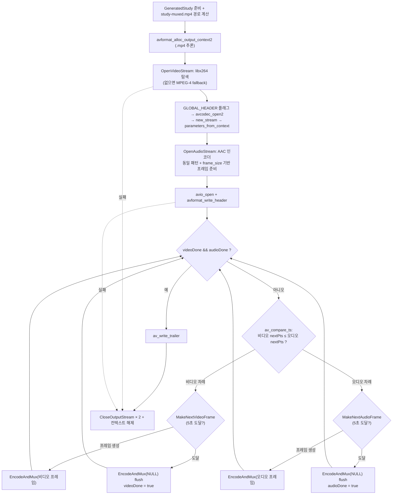

# 11. 먹싱 (비디오 + 오디오 → mp4)

> 소스: `study-FFMPEG/11-muxing/main.c` · 타겟: `studyFFMPEG11Muxing` · [← 트랙 개요](README.md)

## 학습 목표

08(비디오 인코딩)과 09(오디오 인코딩)를 합쳐 **두 스트림을 가진 완전한 mp4 파일**을 만든다. 합성 그라데이션 영상 5초와 440Hz 사인파 오디오를 각각 인코딩하면서, `av_compare_ts()`로 "다음 pts가 더 이른 쪽"을 먼저 인코딩해 두 스트림이 시간순으로 고르게 섞이는 **인터리빙**을 구현한다. mp4처럼 코덱 설정을 컨테이너 헤더에 저장하는 포맷의 `AVFMT_GLOBALHEADER` / `AV_CODEC_FLAG_GLOBAL_HEADER` 처리도 배운다.

## 핵심 개념

### StudyOutputStream — 스트림 하나의 세트

비디오와 오디오는 "인코더 컨텍스트 + 출력 스트림 + 재사용 프레임 + 다음 pts"라는 동일한 구성을 가지므로, 이를 구조체로 묶어 대칭적으로 다룬다:

```c
typedef struct StudyOutputStream {
    AVStream *pStream;
    AVCodecContext *pEncoderContext;
    AVFrame *pFrame;
    int64_t nextPts;    /* 다음 프레임의 pts (각 인코더 time_base 단위) */
    double sinePhase;   /* 오디오 전용: 사인파 위상 */
} StudyOutputStream;
```

### av_compare_ts — 서로 다른 time_base의 시간 비교

비디오 pts는 `1/25`초 단위, 오디오 pts는 `1/44100`초 단위라 숫자를 직접 비교할 수 없다. `av_compare_ts(pts1, tb1, pts2, tb2)`는 각자의 time_base를 반영해 **실제 시각**을 비교해 준다. 메인 루프는 매번 두 스트림의 `nextPts`를 비교해 더 뒤처진 쪽을 인코딩하므로, 파일 안에서 비디오/오디오 패킷이 시간순으로 고르게 섞인다. 같은 함수를 "pts가 5초(`{1,1}` 단위)에 도달했는가?" 검사에도 재활용한다.

### AVFMT_GLOBALHEADER와 AV_CODEC_FLAG_GLOBAL_HEADER

mp4는 SPS/PPS 같은 코덱 설정을 각 패킷이 아니라 **컨테이너 헤더(moov 박스)에 한 번만** 저장한다. 이런 포맷은 `oformat->flags`에 `AVFMT_GLOBALHEADER`가 켜져 있으며, 이때는 인코더에 `AV_CODEC_FLAG_GLOBAL_HEADER`를 줘서 "설정 데이터를 패킷에 넣지 말고 extradata로 분리해 달라"고 알려야 한다. 이 플래그는 `avcodec_open2()` **전에** 설정해야 한다.

### 준비 순서: 인코더 open → 스트림 생성 → parameters_from_context

각 스트림마다 08/09에서 배운 패턴을 반복한다: 인코더 설정 → (GLOBAL_HEADER 플래그) → `avcodec_open2()` → `avformat_new_stream()` → `avcodec_parameters_from_context()`로 인코더 설정(extradata 포함)을 스트림 codecpar에 복사. 먹서는 이 codecpar를 보고 mp4 헤더를 만든다.

### 스트림별 flush

두 스트림은 서로 다른 시점에 끝나므로(마지막 프레임의 시간 단위가 다르다), 각 스트림이 목표 길이에 도달하는 순간 **그 스트림의 인코더만** NULL 프레임으로 flush하고 done 플래그를 세운다. 두 스트림이 모두 끝나야 루프를 빠져나와 트레일러를 쓴다.

## 프로그램 흐름



## 핵심 API

| API / 구조체 | 역할 |
|---|---|
| `av_compare_ts()` | 서로 다른 time_base의 두 타임스탬프를 실제 시각 기준으로 비교(-1/0/1) |
| `AVFMT_GLOBALHEADER` | 이 컨테이너는 코덱 설정을 글로벌 헤더에 저장한다는 출력 포맷 플래그 |
| `AV_CODEC_FLAG_GLOBAL_HEADER` | 인코더에게 설정 데이터를 패킷 대신 extradata로 분리하라고 지시 |
| `avcodec_find_encoder_by_name()` | 이름("libx264")으로 인코더 탐색. ID 탐색과 달리 특정 구현을 지정 |
| `avcodec_parameters_from_context()` | 인코더 설정(extradata 포함) → 스트림 codecpar 복사 |
| `av_opt_set()` | 인코더 전용 옵션 설정 (libx264의 preset 등, `priv_data` 대상) |
| `av_frame_make_writable()` | 재사용 프레임을 쓰기 가능 상태로 만든다(필요 시 버퍼 복사) |
| `av_packet_rescale_ts()` | 인코더 time_base → 스트림 time_base 변환 |
| `av_interleaved_write_frame()` | 두 스트림의 패킷을 dts 순서로 버퍼링하며 쓴다 |
| `avcodec_send_frame(ctx, NULL)` | 해당 인코더 flush 시작 (스트림별로 따로 수행) |

## 이전 레슨과의 차이

- **08 + 09 + 10의 종합편**이다. 08의 합성 비디오 인코딩, 09의 사인파 오디오 인코딩과 먹서 쓰기, 10의 `av_interleaved_write_frame` 인터리빙이 한 프로그램에 모두 등장한다.
- 인코더가 **두 개**, 스트림이 **두 개**다. 이를 대칭적으로 다루기 위해 `StudyOutputStream` 구조체를 도입했고, `EncodeAndMux()`도 구조체를 받아 비디오/오디오 공용이 됐다.
- 새로 등장한 것: `av_compare_ts()` 기반 **인터리빙 순서 결정**, `AVFMT_GLOBALHEADER`/`AV_CODEC_FLAG_GLOBAL_HEADER` 처리, 스트림별 개별 flush.
- 09의 adts(단일 스트림, 헤더 없는 스트리밍 포맷)와 달리 mp4는 글로벌 헤더가 필요한 진짜 컨테이너라서, 인코더 open 전에 컨테이너의 요구사항을 반영해야 하는 **컨테이너 ↔ 인코더 상호작용**이 처음 나타난다.

## ⚠️ 알아두기

- **이 저장소의 vcpkg ffmpeg에는 libx264가 없다.** 따라서 `avcodec_find_encoder_by_name("libx264")`이 NULL을 반환하고 MPEG-4(Part 2) 인코더로 fallback한다. 실행 로그에 `libx264 not found → fallback to MPEG-4 encoder`가 찍히며, ffprobe로 확인하면 비디오 코덱이 h264가 아니라 `mpeg4`다. H.264로 만들고 싶다면 vcpkg ffmpeg에 x264 피처를 추가해 다시 빌드해야 한다.
- 비디오와 오디오의 마지막 프레임 시각이 정확히 일치하지 않으므로(비디오 5.00초, 오디오는 1024샘플 단위) 최종 duration은 5.015초처럼 5초보다 약간 길게 나온다.
- `AV_CODEC_FLAG_GLOBAL_HEADER`를 빼먹으면 mp4에서 재생기 호환성 문제가 생기거나 먹서가 경고를 낸다. 반대로 adts 같은 포맷에 이 플래그를 주면 헤더 정보가 패킷에서 빠져 재생이 안 될 수 있다 — 그래서 항상 `oformat->flags & AVFMT_GLOBALHEADER`로 조건 분기한다.

## 실행 방법

```bash
# 빌드 (저장소 루트에서)
cmake --build cmake-build-debug --target studyFFMPEG11Muxing
# 실행 (빌드 트리 안에서 실행해야 리소스 경로 계산이 성공한다)
./cmake-build-debug/study-FFMPEG/11-muxing/studyFFMPEG11Muxing
```

- 입력: 없음 (비디오·오디오 모두 코드에서 합성)
- **출력: `resources/GeneratedStudy/study-muxed.mp4`** — 총 342개 패킷, mpeg4 비디오 + aac 오디오, 5.015초
- 재생 확인: `ffplay resources/GeneratedStudy/study-muxed.mp4` (움직이는 그라데이션 + 440Hz 톤)

---
→ 자세한 코드 해설: [코드 상세 해설](11-muxing-deep-dive.md)
