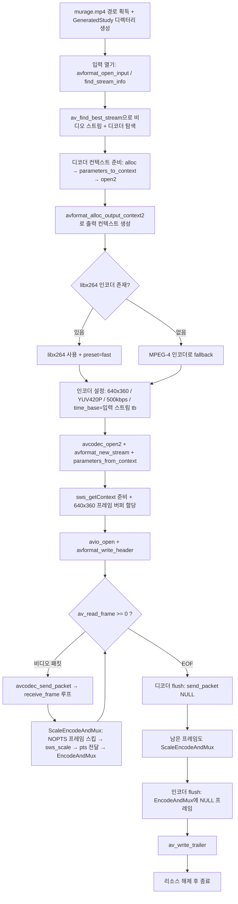

# 12. 트랜스코딩

> 소스: `study-FFMPEG/12-transcoding/main.c` · 타겟: `studyFFMPEG12Transcoding` · [← 트랙 개요](README.md)

## 학습 목표

지금까지 개별 레슨에서 따로 배운 디먹싱 → 디코딩 → 스케일링 → 인코딩 → 먹싱을 **하나의 파이프라인**으로 연결해, murage.mp4(1280x720)를 640x360 / 500kbps 비디오로 재인코딩한 study-transcoded.mp4를 만든다. 파이프라인을 관통하는 타임스탬프(pts) 전달 전략과, 종료 시 반드시 지켜야 하는 flush 순서(디코더 → 인코더 → trailer)를 익힌다.

## 핵심 개념

### 트랜스코딩 = 배운 것들의 조립

트랜스코딩(transcoding)은 압축된 미디어를 풀었다가 다른 사양으로 다시 압축하는 작업이다. 새로운 API는 거의 없고, 지금까지 배운 다섯 단계를 순서대로 잇는 것이 전부다.

| 단계 | 하는 일 | 배운 레슨 |
|---|---|---|
| 디먹싱 | `av_read_frame()`으로 컨테이너에서 압축 패킷 추출 | 03 |
| 디코딩 | `avcodec_send_packet` / `avcodec_receive_frame` | 04 |
| 스케일링 | `sws_scale()`로 1280x720 → 640x360 변환 | 06 |
| 인코딩 | `avcodec_send_frame` / `avcodec_receive_packet` | 08 |
| 먹싱 | `av_interleaved_write_frame()`으로 mp4에 기록 | 11 |

### 타임스탬프 전달 전략: time_base 통일

디코딩된 프레임의 pts는 **입력 스트림의 time_base** 단위다. 인코더의 time_base를 입력 스트림의 time_base와 똑같이 맞추면(`pEncoderContext->time_base = pInputStream->time_base`), 디코딩된 프레임의 pts를 **변환 없이 그대로** 인코더에 넘길 수 있다(pts passthrough). 인코더에서 나온 패킷은 마지막에 `av_packet_rescale_ts()` 한 번으로 출력 스트림 time_base에 맞추면 된다.

### best_effort_timestamp

일부 프레임은 pts가 없을 수 있다(`AV_NOPTS_VALUE`). `AVFrame->best_effort_timestamp`는 pts·dts·프레임 간격 등을 종합해 FFmpeg이 추정한 "최선의 타임스탬프"로, 트랜스코딩처럼 모든 프레임에 유효한 pts가 필요한 작업에서 안전한 선택이다. 그럼에도 `best_effort_timestamp`조차 `AV_NOPTS_VALUE`인 프레임은 인코더에 넣지 않고 건너뛴다 — 그대로 먹싱하면 `non monotonically increasing dts` 에러로 기록이 끊기기 때문이다.

### flush 순서가 중요한 이유

디코더와 인코더는 둘 다 내부에 프레임/패킷을 쌓아 두는 큐다. 파일 읽기가 끝났다고 바로 trailer를 쓰면 큐에 남은 데이터가 버려진다. 반드시 다음 순서를 지킨다.

1. **디코더 flush**: `avcodec_send_packet(ctx, NULL)` → 디코더에 남은 프레임을 모두 꺼내 인코더로 보낸다
2. **인코더 flush**: `avcodec_send_frame(ctx, NULL)` → 인코더에 남은 패킷을 모두 꺼내 파일에 쓴다
3. **`av_write_trailer()`**: 인덱스 등 컨테이너 마무리 정보를 기록한다

## 프로그램 흐름



## 핵심 API

| API / 구조체 | 역할 |
|---|---|
| `av_find_best_stream()` | 가장 적합한 비디오 스트림을 찾고 디코더까지 함께 알려준다 |
| `avcodec_find_encoder_by_name()` | 이름("libx264")으로 인코더를 찾는다. 없으면 NULL |
| `avformat_alloc_output_context2()` | 출력 파일 확장자로 mp4 먹서 컨텍스트를 만든다 |
| `av_guess_frame_rate()` | 스트림 정보에서 실제 프레임레이트를 추정한다 |
| `AVCodecContext->time_base` | 인코더에 넘길 프레임 pts의 시간 단위. 입력 스트림과 통일 |
| `AVFrame->best_effort_timestamp` | pts가 없는 프레임까지 고려한 최선의 타임스탬프 |
| `sws_scale()` | 1280x720 → 640x360 해상도 변환 |
| `av_packet_rescale_ts()` | 인코더 time_base → 출력 스트림 time_base로 패킷 타임스탬프 변환 |
| `av_interleaved_write_frame()` | 패킷을 인터리빙 순서에 맞게 파일에 기록 |
| `avcodec_send_packet(ctx, NULL)` | 디코더 flush 진입 |
| `avcodec_send_frame(ctx, NULL)` | 인코더 flush 진입 |
| `av_write_trailer()` | 컨테이너 마무리(인덱스 등) 기록 |

## 이전 레슨과의 차이

- 이 레슨은 새 API를 배우는 레슨이 아니라 **03(디먹싱) + 04(디코딩) + 06(스케일링) + 08(인코딩) + 11(먹싱)을 하나로 통합**하는, 이 트랙의 정점에 해당하는 레슨이다.
- 08(인코딩)에서는 프레임 pts를 직접 만들어 붙였지만, 여기서는 **실제 입력 영상의 pts를 그대로 통과**시킨다. 이를 위해 인코더 time_base를 입력 스트림 time_base로 맞추는 전략이 새로 등장한다.
- 11(먹싱, 리먹싱)에서는 패킷을 재인코딩 없이 복사했지만, 여기서는 완전히 풀었다가 다른 해상도/비트레이트로 다시 압축한다.
- 종료 절차가 2단 flush(디코더 → 인코더)로 확장됐다. 지금까지는 한쪽만 flush하면 됐다.

## ⚠️ 알아두기

- **vcpkg로 빌드한 FFmpeg에는 libx264가 없어 MPEG-4 인코더로 fallback된다.** 실행 로그에 `libx264 not found → fallback to MPEG-4 encoder`가 출력되고, 결과 파일을 ffprobe로 확인하면 코덱이 `mpeg4`(H.264 아님)로 나온다. 코드 자체는 libx264가 있으면 H.264로 인코딩하도록 작성되어 있다.
- 학습 단순화를 위해 **오디오 스트림은 버린다**(출력 mp4에는 비디오만 있다). 오디오까지 포함하려면 07의 리샘플링과 11의 인터리빙을 추가하면 된다.
- 실측 결과: murage.mp4(h264 1280x720 30fps, 12.78초) 입력 → 383개 패킷이 기록되고, ffprobe로 mpeg4 640x360이 확인된다.

## 실행 방법

```bash
# 빌드 (저장소 루트에서)
cmake --build cmake-build-debug --target studyFFMPEG12Transcoding
# 실행
./cmake-build-debug/study-FFMPEG/12-transcoding/studyFFMPEG12Transcoding
```

- **입력: `resources/murage.mp4`** (실행 경로에서 `/cmake` 문자열 앞부분을 잘라 `resources/`를 붙이는 방식이므로 `cmake-build-*` 아래에서 실행해야 경로 계산이 성공한다)
- 출력물: `resources/GeneratedStudy/study-transcoded.mp4` (640x360, 비디오만). `ffplay`로 재생하거나 `ffprobe`로 사양을 확인할 수 있다.

---
→ 자세한 코드 해설: [코드 상세 해설](12-transcoding-deep-dive.md)
