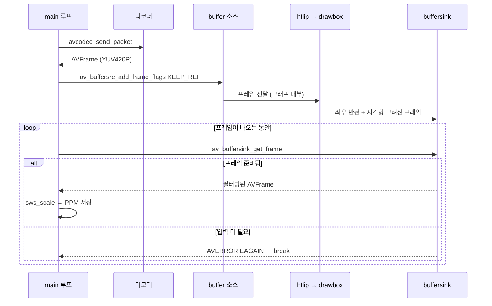

# 13. 비디오 필터링 (libavfilter) — 코드 상세 해설

> [← 기본 문서](13-filtering-video.md)

## 전체 구조

`main()`은 04 레슨의 디코딩 골격을 그대로 쓰고, 그 위에 **필터 그래프 구성**(2단계)과 **디코딩 → 필터 → 저장 3중 루프**(4단계)를 얹는다.

| 구성 요소 | 역할 |
|---|---|
| `main()` | 디코더 준비 → 필터 그래프 구성 → 디코딩/필터/저장 루프 → 해제 |
| `FILTER_DESCRIPTION` 매크로 | `ffmpeg -vf` 문법의 필터 체인 문자열 |
| `SavePPMImage()` | RGB24 데이터를 P6 PPM 파일로 저장 (05와 동일) |
| `EnsureGeneratedStudyDirectory()` | `resources/GeneratedStudy/` 디렉터리 생성 |
| `GetResourcePath()` | 실행 경로에서 저장소 루트의 `resources/` 경로 역산 |

```text
main
 ├─ 1. 입력 + 디코더 준비 (04와 동일)
 ├─ 2. 필터 그래프 구성
 │    ├─ avfilter_graph_alloc
 │    ├─ buffer 소스 생성 (args 문자열)
 │    ├─ buffersink 싱크 생성 + pix_fmts 고정 (av_opt_set_int_list)
 │    ├─ AVFilterInOut inputs/outputs 연결
 │    ├─ avfilter_graph_parse_ptr (문자열 파싱)
 │    └─ avfilter_graph_config (검증 + 링크 확정)
 ├─ 3. RGB 변환 준비 (sws + av_image_alloc)
 ├─ 4. while (av_read_frame)
 │    └─ send_packet → receive_frame
 │         └─ buffersrc_add_frame → buffersink_get_frame
 │              └─ sws_scale → SavePPMImage
 └─ ffmpeg_release: InOut → 프레임 → 그래프 → 코덱 → 포맷 순 해제
```

## 코드 블록별 해설

### 1. 필터 기술 문자열과 새 헤더

```c
#include <libavutil/opt.h>
#include <libavfilter/avfilter.h>
#include <libavfilter/buffersrc.h>
#include <libavfilter/buffersink.h>
```

```c
/** PPM으로 저장할 필터링 결과 프레임 수 */
#define SAVE_FRAME_MAX              5
/**
 * 필터 그래프 기술 문자열 (ffmpeg -vf 와 같은 문법).
 * hflip   : 좌우 반전
 * drawbox : 좌상단에 빨간 사각형 그리기
 */
#define FILTER_DESCRIPTION          "hflip,drawbox=x=10:y=10:w=100:h=100:color=red:t=8"
```

libavfilter 본체 외에 buffer 소스와 buffersink 싱크 전용 헤더 두 개, 그리고 buffersink 옵션 설정(`av_opt_set_int_list`)을 위한 `libavutil/opt.h`가 추가로 필요하다. 필터 문자열의 문법: `,`로 필터를 잇고, 필터 이름 뒤 `=` 다음에 `키=값` 옵션들을 `:`로 나열한다. `t=8`은 사각형 테두리 두께 8픽셀이다.

### 2. 필터 그래프 관련 변수

```c
/** 필터 그래프 구성 요소 */
AVFilterGraph *pFilterGraph = NULL;
AVFilterContext *pBufferSourceContext = NULL;
AVFilterContext *pBufferSinkContext = NULL;
AVFilterInOut *pInputs = NULL;
AVFilterInOut *pOutputs = NULL;
```

- `AVFilterGraph`: 필터 노드들을 담는 컨테이너
- `AVFilterContext`: 그래프 안의 필터 **인스턴스**. 같은 필터도 그래프에 여러 개 넣을 수 있으므로 정의(`AVFilter`)와 인스턴스(`AVFilterContext`)가 분리되어 있다 — `AVCodec`과 `AVCodecContext`의 관계와 같다.
- `AVFilterInOut`: 문자열로 파싱된 그래프의 열린 끝을 표현하는 연결 리스트

### 3. buffer 소스 생성 — args로 입력 사양 선언

```c
snprintf(filterSourceArgs, sizeof(filterSourceArgs),
         "video_size=%dx%d:pix_fmt=%d:time_base=%d/%d:pixel_aspect=%d/%d",
         pVideoCodecContext->width, pVideoCodecContext->height,
         pVideoCodecContext->pix_fmt,
         pFormatContext->streams[videoStreamIdx]->time_base.num,
         pFormatContext->streams[videoStreamIdx]->time_base.den,
         pVideoCodecContext->sample_aspect_ratio.num,
         pVideoCodecContext->sample_aspect_ratio.den > 0 ? pVideoCodecContext->sample_aspect_ratio.den : 1);

errorCode = avfilter_graph_create_filter(&pBufferSourceContext,
                                         avfilter_get_by_name("buffer"), "in",
                                         filterSourceArgs, NULL, pFilterGraph);
```

buffer 필터는 스스로 입력 포맷을 알 수 없으므로(디코더처럼 비트스트림을 읽는 게 아니라 우리가 프레임을 직접 넣는다) 사양을 문자열 인자로 선언한다.

- `video_size` / `pix_fmt`: 들어올 프레임의 해상도와 픽셀 포맷. `pix_fmt=%d`로 enum 정수값(YUV420P = 0)을 그대로 쓴다.
- `time_base`: 프레임 pts의 시간 단위. 필터 중에는 시간 정보에 의존하는 것(fps, setpts 등)이 있어 필수다.
- `pixel_aspect`: 픽셀 화면비. `den > 0 ? den : 1` 삼항 연산은 `sample_aspect_ratio`가 0/0인 파일에서 "0/0" 문자열이 만들어져 파싱이 실패하는 것을 막는 보정이다.
- `"in"`은 이 필터 인스턴스의 이름으로, 이후 InOut 연결에서 참조된다.

### 4. buffersink 싱크 생성 + 출력 픽셀 포맷 고정

```c
errorCode = avfilter_graph_create_filter(&pBufferSinkContext,
                                         avfilter_get_by_name("buffersink"), "out",
                                         NULL, NULL, pFilterGraph);
```

싱크는 나오는 프레임을 받기만 하므로 args가 필요 없다(NULL). 대신 생성 직후 **싱크가 내놓을 픽셀 포맷을 옵션으로 고정**한다.

```c
/**
 * 싱크가 내놓을 픽셀 포맷을 입력과 같게 고정한다.
 * 고정하지 않으면 필터 체인에 따라 다른 포맷이 나올 수 있고,
 * 그러면 아래에서 만든 RGB 변환용 SwsContext와 어긋난다.
 * (필요하면 libavfilter가 변환 필터를 자동 삽입해 포맷을 맞춰준다)
 */
{
    enum AVPixelFormat sinkPixelFormats[] = {pVideoCodecContext->pix_fmt, AV_PIX_FMT_NONE};
    errorCode = av_opt_set_int_list(pBufferSinkContext, "pix_fmts", sinkPixelFormats,
                                    AV_PIX_FMT_NONE, AV_OPT_SEARCH_CHILDREN);
    if (errorCode < 0) {
        av_log(NULL, AV_LOG_ERROR, "[FFMPEG ERROR](%d) Failed Set Sink Pixel Format...\r\n", errorCode);
        goto ffmpeg_release;
    }
}
```

- `pix_fmts`는 "싱크가 받아들일 포맷 목록"이다. `AV_PIX_FMT_NONE`으로 끝나는 배열을 `av_opt_set_int_list()`로 넘기면, 그래프 확정(`avfilter_graph_config`) 시 포맷 협상이 이 목록 안에서만 이루어진다.
- 여기서는 디코더의 `pix_fmt` 하나만 허용하므로 싱크에서 나오는 프레임은 **항상 입력과 같은 포맷**이다. 뒤에서 만드는 RGB 변환용 SwsContext가 디코더 포맷을 가정하고 있기 때문에, 이 고정이 없으면 필터 체인이 다른 포맷을 내놓을 때 변환 결과가 깨진다.
- 필터 체인의 실제 출력 포맷이 목록과 다르면 libavfilter가 변환 필터(scale 등)를 자동 삽입해 맞춰준다.
- `AV_OPT_SEARCH_CHILDREN`은 옵션을 필터 컨텍스트의 하위 객체까지 검색해 설정하라는 플래그로, buffersink 옵션 설정의 관례적 인자다.

### 5. AVFilterInOut — 열린 끝 연결 (가장 헷갈리는 부분)

```c
pOutputs = avfilter_inout_alloc();
pInputs = avfilter_inout_alloc();
if (pOutputs == NULL || pInputs == NULL) {
    goto ffmpeg_release;
}

pOutputs->name = av_strdup("in");
pOutputs->filter_ctx = pBufferSourceContext;
pOutputs->pad_idx = 0;
pOutputs->next = NULL;

pInputs->name = av_strdup("out");
pInputs->filter_ctx = pBufferSinkContext;
pInputs->pad_idx = 0;
pInputs->next = NULL;

errorCode = avfilter_graph_parse_ptr(pFilterGraph, FILTER_DESCRIPTION, &pInputs, &pOutputs, NULL);
```

이름이 반대로 느껴지는 이유: **outputs/inputs는 문자열 그래프가 아니라 "우리 쪽" 기준**이다.

- `pOutputs`: 우리 소스(`in`)의 **출력** → 문자열 그래프(`hflip`)의 입력에 연결된다
- `pInputs`: 문자열 그래프(`drawbox`)의 출력 → 우리 싱크(`out`)의 **입력**에 연결된다

`pad_idx = 0`은 필터의 첫 번째 입출력 패드를 쓴다는 뜻이고(대부분의 필터는 패드가 하나), `next = NULL`은 열린 끝이 하나뿐이라는 뜻이다(overlay처럼 입력이 2개인 그래프라면 연결 리스트로 잇는다). `avfilter_graph_parse_ptr()`는 파싱하면서 소비한 InOut을 해제·갱신하므로 포인터의 주소(`&pInputs`)를 넘긴다.

### 6. 그래프 확정

```c
/** 그래프 유효성 검사 + 내부 링크 설정 완료 */
errorCode = avfilter_graph_config(pFilterGraph, NULL);
```

모든 필터가 연결됐는지, 인접한 필터끼리 주고받을 수 있는 픽셀 포맷이 존재하는지(포맷 협상 — 필요하면 FFmpeg이 변환 필터를 자동 삽입한다)를 검사하고 링크를 확정한다. 이 호출이 성공해야 프레임을 넣을 수 있다.

### 7. 3중 루프 — 디코딩 → 필터 push → 필터 pull

```c
while (savedFrameCount < SAVE_FRAME_MAX && av_read_frame(pFormatContext, pPacket) >= 0) {
    if (pPacket->stream_index == videoStreamIdx) {
        errorCode = avcodec_send_packet(pVideoCodecContext, pPacket);
        ...
        while (savedFrameCount < SAVE_FRAME_MAX) {
            errorCode = avcodec_receive_frame(pVideoCodecContext, pFrame);
            if (errorCode == AVERROR(EAGAIN) || errorCode == AVERROR_EOF) {
                break;
            } else if (errorCode < 0) {
                break;
            }

            /** 디코딩된 프레임을 그래프에 밀어 넣기 */
            errorCode = av_buffersrc_add_frame_flags(pBufferSourceContext, pFrame,
                                                     AV_BUFFERSRC_FLAG_KEEP_REF);
```

바깥부터 (1) 패킷 읽기, (2) 프레임 받기, (3) 필터 결과 꺼내기의 3중 루프다. 모든 단계가 `savedFrameCount < SAVE_FRAME_MAX` 조건을 공유해 5장을 저장하면 어느 깊이에서든 즉시 멈춘다.

`AV_BUFFERSRC_FLAG_KEEP_REF`가 중요하다. 이 플래그가 없으면 `av_buffersrc_add_frame()`은 프레임의 버퍼 소유권을 그래프로 **이동**시켜 호출 후 `pFrame`이 비워진다. KEEP_REF는 참조 카운트만 올려 그래프와 우리가 프레임을 공유하게 하고, 우리는 쓰고 난 뒤 평소처럼 `av_frame_unref(pFrame)`으로 참조를 놓는다.

### 8. 필터 결과 꺼내기 — 디코더와 같은 EAGAIN 패턴

```c
/** 필터링 완료된 프레임 꺼내기 (디코더처럼 EAGAIN 처리) */
while (savedFrameCount < SAVE_FRAME_MAX) {
    errorCode = av_buffersink_get_frame(pBufferSinkContext, pFilteredFrame);
    if (errorCode == AVERROR(EAGAIN) || errorCode == AVERROR_EOF) {
        break;
    } else if (errorCode < 0) {
        break;
    }
```

`av_buffersink_get_frame()`의 반환 규약은 `avcodec_receive_frame()`과 완전히 같다 — `EAGAIN`은 "필터가 프레임을 내놓으려면 입력이 더 필요하다"(에러 아님), `AVERROR_EOF`는 그래프 flush 완료. hflip/drawbox는 1프레임 입력 → 1프레임 출력이지만, fps 변경이나 프레임 보간 필터라면 입력 1장에 0장 또는 여러 장이 나올 수 있어 while 루프가 필수다.

### 9. RGB 변환 + PPM 저장

```c
/** YUV → RGB 변환 후 PPM 저장 */
sws_scale(pSwsContext,
          (const uint8_t *const *) pFilteredFrame->data, pFilteredFrame->linesize,
          0, pFilteredFrame->height,
          rgbData, rgbLineSize);

snprintf(outputName, sizeof(outputName),
         "GeneratedStudy/study-filtered-%03d.ppm", savedFrameCount);
memset(outputPath, 0, sizeof(outputPath));
if (GetResourcePath(outputName, outputPath) &&
    SavePPMImage(outputPath, rgbData[0], rgbLineSize[0],
                 pFilteredFrame->width, pFilteredFrame->height)) {
    printf("saved : %s\r\n", outputPath);
    savedFrameCount++;
}
av_frame_unref(pFilteredFrame);
```

필터를 통과한 프레임도 여전히 YUV420P이므로, PPM(RGB24)으로 저장하려면 06에서 배운 sws 변환이 필요하다. 재사용되는 `outputPath` 버퍼는 매번 `memset`으로 비워 이전 경로가 남지 않게 한다(`GetResourcePath()` 자체는 `snprintf`로 길이를 검사하며 경로를 조립한다). `%03d` 포맷으로 `study-filtered-000.ppm` ~ `study-filtered-004.ppm`이 만들어진다.

### 10. 자원 해제 — 그래프가 필터를 함께 정리

```c
exitStatus = 0;

ffmpeg_release:
avfilter_inout_free(&pInputs);
avfilter_inout_free(&pOutputs);
av_frame_free(&pFilteredFrame);
av_frame_free(&pFrame);
av_packet_free(&pPacket);
av_freep(&rgbData[0]);
sws_freeContext(pSwsContext);
/** 그래프 해제 시 그래프에 속한 필터 컨텍스트(소스/싱크)도 함께 해제된다 */
avfilter_graph_free(&pFilterGraph);
avcodec_free_context(&pVideoCodecContext);
avformat_close_input(&pFormatContext);
if (exitStatus == 0) {
    printf("Filtering Video Done!\r\n");
} else {
    printf("Finished with error(s)...\r\n");
}
return exitStatus;
```

- `avfilter_inout_free()`: `avfilter_graph_parse_ptr()`가 성공하면 InOut을 스스로 해제하고 포인터를 NULL로 만들어 두므로, 여기서의 해제는 **파싱 전에 실패해 goto로 왔을 때**를 위한 안전장치다(NULL이면 no-op).
- `avfilter_graph_free()`: 그래프에 등록된 모든 `AVFilterContext`(buffer 소스, buffersink 포함)를 함께 해제한다. `pBufferSourceContext`를 따로 해제하면 이중 해제가 된다.
- `exitStatus`는 `-1`로 시작해 성공 경로 끝에서만 `0`으로 바뀐다. 에러로 `goto ffmpeg_release`를 타면 `-1`인 채 0이 아닌 종료 코드로 끝나므로 셸/CI에서 실패를 감지할 수 있다.

## 심화: push/pull 파이프라인 시퀀스



디코더(04) → 필터 그래프(13) → 인코더(08)까지, FFmpeg의 프레임 처리 컴포넌트는 모두 "넣고-꺼내고-EAGAIN이면 다음 입력" 패턴으로 통일되어 있다. 이 패턴 하나만 몸에 익히면 어떤 컴포넌트든 같은 방식으로 조립할 수 있다.

## ⚠️ 코드 특이점 상세

1. **그래프 flush를 하지 않는다**
   파일 전체를 처리한다면 `av_buffersrc_add_frame_flags(src, NULL, 0)`으로 그래프에 EOF를 알려 내부에 지연된 프레임을 모두 꺼내야 한다. 이 예제는 앞쪽 5장만 저장하고 끝나므로 생략해도 결과에 차이가 없다.

2. **buffersink의 출력 포맷을 `pix_fmts`로 고정한다**
   hflip/drawbox는 포맷을 바꾸지 않지만, 필터 체인을 바꿔도 안전하도록 buffersink에 `av_opt_set_int_list()`로 디코더의 `pix_fmt`를 고정해 두었다. 덕분에 미리 만들어 둔 sws 컨텍스트(디코더 포맷 가정)와 항상 일치하고, 포맷이 다른 체인에서는 libavfilter가 변환 필터를 자동 삽입한다.

3. **`pInputs`/`pOutputs` 이름 방향에 주의**
   `pOutputs`가 소스(in) 쪽, `pInputs`가 싱크(out) 쪽이다. "문자열 그래프에서 봤을 때의 입력/출력"이 아니라 "우리가 만든 필터에서 나가는/들어가는 방향" 기준이라 처음 보면 반대로 읽히기 쉽다.

4. **드문 케이스: 필터 내부 버퍼링**
   대부분의 프레임에서 push 1회 → pull 1회지만, 필터가 내부적으로 프레임을 잡아 두면 `EAGAIN`이 나온 뒤 다음 push 때 한꺼번에 여러 장이 나올 수 있다. 안쪽 pull 루프가 while인 이유다.
