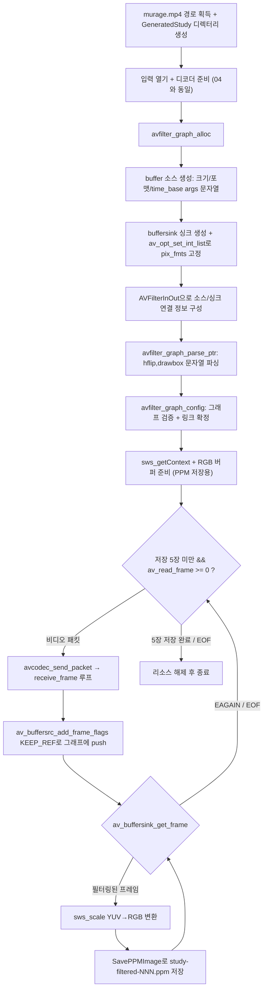

# 13. 비디오 필터링 (libavfilter)

> 소스: `study-FFMPEG/13-filtering-video/main.c` · 타겟: `studyFFMPEG13FilteringVideo` · [← 트랙 개요](README.md)

## 학습 목표

`ffmpeg -vf "hflip,drawbox=..."` 명령이 내부에서 하는 일을 **libavfilter** C API로 직접 만든다. 필터 그래프(AVFilterGraph)를 구성하고, 디코딩된 프레임을 buffer 소스로 밀어 넣고(push) buffersink 싱크에서 꺼내는(pull) 흐름을 익힌다. 결과로 좌우 반전 + 빨간 사각형이 그려진 프레임 5장을 PPM으로 저장한다.

## 핵심 개념

### 필터 그래프의 구조

libavfilter는 필터들을 노드로 잇는 방향 그래프로 동작한다. 이 레슨의 그래프는 다음과 같다.

```text
[buffer 소스] → hflip → drawbox → [buffersink 싱크]
```

| 구성 요소 | 역할 |
|---|---|
| `buffer` (소스 필터) | 우리가 디코딩한 프레임을 그래프에 "밀어 넣는" 입구 |
| `hflip` | 프레임 좌우 반전 |
| `drawbox` | 지정 위치에 사각형 그리기 (x=10, y=10, 100x100, 빨강, 두께 8) |
| `buffersink` (싱크 필터) | 필터링이 끝난 프레임을 "꺼내는" 출구 |

### 필터 기술 문자열

가운데 필터들은 `ffmpeg -vf`와 완전히 같은 문법의 문자열 하나로 기술한다.

```text
hflip,drawbox=x=10:y=10:w=100:h=100:color=red:t=8
```

`,`가 필터 체인 연결, `=` 뒤가 해당 필터의 옵션들(`:` 구분)이다. 이 문자열을 `avfilter_graph_parse_ptr()`가 파싱해 그래프 중간 부분을 만들어 준다.

### buffer 소스의 args — 입력 프레임의 사양 선언

buffer 필터는 "이제부터 이런 프레임이 들어온다"는 사양을 미리 알아야 한다. 크기·픽셀 포맷·time_base·화면비를 문자열 인자로 전달한다.

```text
video_size=1280x720:pix_fmt=0:time_base=1/15360:pixel_aspect=1/1
```

### buffersink의 출력 픽셀 포맷 고정

buffersink는 만들자마자 `av_opt_set_int_list()`로 `pix_fmts` 옵션에 **디코더의 픽셀 포맷 하나만** 허용 목록으로 등록한다. 이렇게 고정하지 않으면 필터 체인에 따라 다른 포맷이 나올 수 있고, 뒤에서 디코더 포맷을 가정하고 만든 RGB 변환용 SwsContext와 어긋나 저장 이미지가 깨진다. 목록과 다른 포맷이 필요한 체인에서는 libavfilter가 변환 필터를 자동 삽입해 포맷을 맞춰준다.

### AVFilterInOut — 문자열 그래프의 "열린 끝" 연결

문자열로 파싱된 `hflip,drawbox` 체인은 입력과 출력이 열려 있다. `AVFilterInOut` 구조체 두 개(outputs/inputs)로 이 열린 끝을 우리가 만든 buffer 소스와 buffersink 싱크에 잇는다. 연결 후 `avfilter_graph_config()`가 그래프 전체의 유효성 검사와 링크 협상을 마무리한다.

### push/pull — 디코더와 같은 패턴

프레임을 그래프에 통과시키는 방식은 디코더의 send/receive와 판박이다.

| 디코더 (04) | 필터 그래프 (13) |
|---|---|
| `avcodec_send_packet()` | `av_buffersrc_add_frame_flags()` |
| `avcodec_receive_frame()` | `av_buffersink_get_frame()` |
| `EAGAIN` = 입력 더 필요 | `EAGAIN` = 입력 더 필요 |
| receive를 while 루프로 | get_frame을 while 루프로 |

## 프로그램 흐름



## 핵심 API

| API / 구조체 | 역할 |
|---|---|
| `avfilter_graph_alloc()` | 빈 필터 그래프를 만든다 |
| `avfilter_get_by_name()` | 이름("buffer", "buffersink")으로 필터 정의를 찾는다 |
| `avfilter_graph_create_filter()` | 그래프 안에 필터 인스턴스(AVFilterContext)를 만든다 |
| `av_opt_set_int_list()` | buffersink의 `pix_fmts` 옵션에 허용 픽셀 포맷 목록을 설정해 출력 포맷을 고정 |
| `AVFilterInOut` | 문자열 그래프의 열린 입/출력을 우리 소스/싱크에 잇는 연결 정보 |
| `avfilter_graph_parse_ptr()` | `ffmpeg -vf` 문법 문자열을 파싱해 그래프 중간을 구성한다 |
| `avfilter_graph_config()` | 그래프 유효성 검사 + 필터 간 링크(포맷 협상) 확정 |
| `av_buffersrc_add_frame_flags()` | 프레임을 그래프에 밀어 넣는다. `AV_BUFFERSRC_FLAG_KEEP_REF`로 원본 프레임 소유권 유지 |
| `av_buffersink_get_frame()` | 필터링 완료된 프레임을 꺼낸다. `EAGAIN`/`AVERROR_EOF`로 상태를 알린다 |
| `avfilter_inout_free()` | AVFilterInOut 연결 정보 해제 |
| `avfilter_graph_free()` | 그래프와 그래프에 속한 모든 필터 컨텍스트를 함께 해제 |

## 이전 레슨과의 차이

- **새 라이브러리 libavfilter가 처음 등장한다.** 지금까지는 libavformat(컨테이너), libavcodec(코덱), libswscale(픽셀 변환), libswresample(오디오 변환)만 사용했다.
- 프레임 가공을 직접 픽셀 연산으로 하지 않고 **선언적 문자열**("hflip,drawbox=...")로 기술한다. FFmpeg에 내장된 수백 개의 필터를 같은 방법으로 조합할 수 있다.
- 필터 그래프의 push/pull 인터페이스가 **디코더의 send/receive와 같은 패턴**임을 확인한다 — `EAGAIN` 처리, while 루프 구조까지 동일하다.
- PPM 저장(05)과 sws RGB 변환(06)은 그대로 재사용한다. 필터 결과가 여전히 YUV420P이기 때문이다.

## ⚠️ 알아두기

- buffer 소스의 args에서 `pixel_aspect` 분모가 0이 되지 않도록 `den > 0 ? den : 1` 보정을 한다. 일부 파일은 `sample_aspect_ratio`가 0/0으로 설정되어 있기 때문이다.
- `AV_BUFFERSRC_FLAG_KEEP_REF` 없이 `av_buffersrc_add_frame()`을 쓰면 프레임 소유권이 그래프로 넘어가 원본 `pFrame`이 빈 껍데기가 된다. 이 코드는 KEEP_REF로 참조만 넘기고 직접 `av_frame_unref()`한다.
- `avfilter_graph_free()`가 그래프에 속한 필터 컨텍스트(소스/싱크)까지 함께 해제하므로 `pBufferSourceContext` 등을 개별 해제하면 안 된다(이중 해제).

## 실행 방법

```bash
# 빌드 (저장소 루트에서)
cmake --build cmake-build-debug --target studyFFMPEG13FilteringVideo
# 실행
./cmake-build-debug/study-FFMPEG/13-filtering-video/studyFFMPEG13FilteringVideo
```

- **입력: `resources/murage.mp4`** (실행 경로에서 `/cmake` 문자열 앞부분을 잘라 `resources/`를 붙이는 방식이므로 `cmake-build-*` 아래에서 실행해야 경로 계산이 성공한다)
- 출력물: `resources/GeneratedStudy/study-filtered-000.ppm` ~ `study-filtered-004.ppm` (1280x720 PPM 5장, 좌우 반전 + 좌상단 빨간 사각형)

---
→ 자세한 코드 해설: [코드 상세 해설](13-filtering-video-deep-dive.md)
