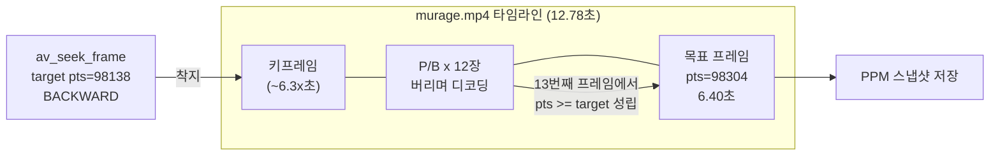

# 14. 시킹 (특정 시점으로 이동) — 코드 상세 해설

> [← 기본 문서](14-seeking.md)

## 전체 구조

`main()`은 04의 디코딩 골격에 시킹 3단계(목표 계산 → `av_seek_frame` → `avcodec_flush_buffers`)를 끼워 넣고, 디코딩 루프를 "목표 pts 도달까지 버리며 전진"하는 형태로 바꾼 것이다.

| 구성 요소 | 역할 |
|---|---|
| `main()` | 디코더 준비 → 목표 계산 → 시킹 + flush → 전진 디코딩 → 스냅샷 저장 |
| `SavePPMImage()` | RGB24 데이터를 P6 PPM 파일로 저장 (05와 동일) |
| `EnsureGeneratedStudyDirectory()` | `resources/GeneratedStudy/` 디렉터리 생성 |
| `GetResourcePath()` | 실행 경로에서 저장소 루트의 `resources/` 경로 역산 |

```text
main
 ├─ 1. 입력 + 디코더 준비 (04와 동일)
 ├─ 2. 목표 시점 계산: duration/2 → av_rescale_q
 ├─ 3. av_seek_frame(BACKWARD) + avcodec_flush_buffers
 ├─ 4. RGB 변환 준비 (sws + av_image_alloc)
 ├─ 5. while (av_read_frame)
 │      └─ send_packet → receive_frame
 │           └─ best_effort_timestamp >= targetPts ? 저장 : 버림
 ├─ 6. 미저장 시 디코더 flush(send_packet NULL) → 남은 프레임까지 검사
 ├─ 7. 그래도 미저장이면 실패(goto ffmpeg_release, exitStatus != 0)
 └─ ffmpeg_release: 역순 해제 + exitStatus 반환
```

## 코드 블록별 해설

### 1. 시킹 관련 변수

```c
/** 목표 시점 (마이크로초 단위, AV_TIME_BASE 기준) */
int64_t targetTimestampUs = 0;
/** 목표 시점 (비디오 스트림 time_base 단위) */
int64_t targetPts = 0;
bool snapshotSaved = false;
int decodedAfterSeek = 0;
```

같은 "시점"을 두 가지 단위로 들고 다닌다 — 사람/컨테이너 기준의 마이크로초(`targetTimestampUs`)와 스트림 기준의 pts(`targetPts`). FFmpeg에서 타임스탬프 버그의 대부분은 이 두 단위를 섞어 쓰는 데서 나오므로, 변수명에 단위를 명시하는 습관이 중요하다. `decodedAfterSeek`은 학습용 카운터로, 키프레임 착지 후 몇 장을 디코딩해야 목표에 닿는지 보여준다.

### 2. 목표 시점 계산 — 50% 지점

```c
/** ===== 2. 목표 시점 계산: 전체 길이의 50% ===== */
targetTimestampUs = pFormatContext->duration / 2;
/** AV_TIME_BASE(1/1,000,000초) 단위 → 비디오 스트림 time_base 단위로 변환 */
targetPts = av_rescale_q(targetTimestampUs, AV_TIME_BASE_Q, pVideoStream->time_base);

printf("duration : %.2f sec → seek target : %.2f sec (pts=%lld)\r\n",
       (double) pFormatContext->duration / AV_TIME_BASE,
       (double) targetTimestampUs / AV_TIME_BASE,
       targetPts);
```

- `pFormatContext->duration`은 항상 `AV_TIME_BASE`(1/1,000,000초) 단위다. murage.mp4는 12,780,000 근처 → 절반이면 약 6.39초.
- `av_rescale_q(a, bq, cq)`는 `a * bq / cq`를 64비트 오버플로 없이 계산한다. 단순 곱셈/나눗셈으로 직접 계산하면 큰 타임스탬프에서 오버플로가 날 수 있어 반드시 이 함수를 쓴다.
- murage.mp4의 비디오 스트림 time_base는 1/15360이므로 6.39초 → `pts=98138`이 된다. 실행 로그: `duration : 12.78 sec → seek target : 6.39 sec (pts=98138)`.

### 3. 시킹 실행 — BACKWARD 플래그

```c
/**
 * ===== 3. 시킹 실행 =====
 * AVSEEK_FLAG_BACKWARD: 목표 지점 "이전"의 키프레임으로 이동.
 * (이 플래그가 없으면 이후 키프레임으로 갈 수 있어 목표를 지나칠 수 있다)
 */
errorCode = av_seek_frame(pFormatContext, videoStreamIdx, targetPts, AVSEEK_FLAG_BACKWARD);
if (errorCode < 0) {
    av_log(NULL, AV_LOG_ERROR, "[FFMPEG ERROR](%d) Failed Seek...\r\n", errorCode);
    goto ffmpeg_release;
}
```

`av_seek_frame()`은 디먹서 수준의 동작이다 — 파일 읽기 위치를 옮길 뿐, 디코더는 건드리지 않는다. 두 번째 인자로 스트림 인덱스를 줬으므로 세 번째 인자 `targetPts`는 **그 스트림의 time_base 단위**로 해석된다(인덱스에 -1을 주면 `AV_TIME_BASE` 단위). `AVSEEK_FLAG_BACKWARD`는 "targetPts를 넘지 않는 가장 가까운 시킹 포인트(키프레임)"를 선택하게 한다. P/B 프레임은 참조 없이 디코딩할 수 없으므로 목표 이전 키프레임에서 출발하는 것만이 유일하게 안전한 전략이다.

### 4. 디코더 flush — 시킹의 필수 파트너

```c
/**
 * 디코더 내부 버퍼 비우기 — 시킹의 필수 파트너.
 * 비우지 않으면 시킹 이전 위치의 프레임 데이터가 섞여 화면이 깨진다.
 */
avcodec_flush_buffers(pVideoCodecContext);
```

디코더는 참조 프레임(직전에 디코딩한 프레임들)을 내부에 보관하는 상태 기계다. 파일 위치만 옮기고 디코더를 그대로 두면, 새 위치의 P 프레임이 **엉뚱한 옛 참조 프레임**을 기준으로 복원되어 블록 노이즈가 낀 깨진 화면이 나온다. `avcodec_flush_buffers()`는 참조 프레임과 내부 지연 큐를 모두 버려 디코더를 "방금 열었을 때" 상태로 되돌린다. `av_seek_frame()` ↔ `avcodec_flush_buffers()`는 항상 한 쌍이라고 외워 두자.

이 예제는 시킹 전에 디코딩을 하지 않아 flush를 생략해도 우연히 동작하지만, 실제 플레이어(재생 중 시킹)에서는 생략하는 순간 바로 화면이 깨진다.

### 5. 전진 디코딩 — 목표 pts까지 버리면서 진행

```c
/**
 * ===== 5. 키프레임부터 목표 pts까지 전진 디코딩 =====
 * 시킹 직후 첫 프레임은 키프레임(목표보다 이전)이므로
 * frame->pts >= targetPts 가 될 때까지 버리면서 디코딩한다.
 */
while (!snapshotSaved && av_read_frame(pFormatContext, pPacket) >= 0) {
    if (pPacket->stream_index == videoStreamIdx) {
        errorCode = avcodec_send_packet(pVideoCodecContext, pPacket);
        if (errorCode < 0) {
            av_packet_unref(pPacket);
            break;
        }

        while (!snapshotSaved) {
            errorCode = avcodec_receive_frame(pVideoCodecContext, pFrame);
            if (errorCode == AVERROR(EAGAIN) || errorCode == AVERROR_EOF) {
                break;
            } else if (errorCode < 0) {
                break;
            }

            decodedAfterSeek++;

            if (pFrame->best_effort_timestamp >= targetPts) {
```

시킹 직후 `av_read_frame()`이 주는 첫 패킷은 착지한 키프레임의 것이다. 그 pts는 목표(98138)보다 **작으므로**, `best_effort_timestamp >= targetPts`가 성립할 때까지 프레임을 세기만 하고(`decodedAfterSeek++`) 버린다. 이 "버려지는" 프레임들은 낭비가 아니다 — P 프레임 체인을 통해 목표 프레임의 픽셀을 복원하는 데 반드시 필요한 재료다.

판정에 `pts`가 아닌 `best_effort_timestamp`를 쓰는 이유: pts가 `AV_NOPTS_VALUE`(매우 큰 음수)인 프레임이 섞여 있어도 dts 기반 추정값으로 비교가 항상 유효하게 유지된다.

### 6. 목표 도달 — 스냅샷 저장

```c
/** 목표 도달 — 스냅샷 저장 */
printf("target frame : pts=%lld (%.2f sec), decoded %d frames after keyframe\r\n",
       pFrame->best_effort_timestamp,
       pFrame->best_effort_timestamp * av_q2d(pVideoStream->time_base),
       decodedAfterSeek);

sws_scale(pSwsContext,
          (const uint8_t *const *) pFrame->data, pFrame->linesize,
          0, pFrame->height,
          rgbData, rgbLineSize);

if (SavePPMImage(outputPath, rgbData[0], rgbLineSize[0],
                 pFrame->width, pFrame->height)) {
    printf("saved : %s\r\n", outputPath);
    snapshotSaved = true;
}
```

`pts * av_q2d(time_base)`는 pts를 초 단위로 환산하는 관용구다(98304 × 1/15360 = 6.40초). 실측 로그:

```text
target frame : pts=98304 (6.40 sec), decoded 13 frames after keyframe
```

이 한 줄이 이 레슨의 핵심 교훈을 압축한다.

- 목표는 pts=98138(6.39초)이었지만 **정확히 그 pts를 가진 프레임은 없다**. 프레임은 이산적이므로 `>=` 비교로 목표 직후의 첫 프레임(98304, 6.40초)을 잡는다.
- `decoded 13 frames` — BACKWARD 시킹이 목표보다 12프레임가량 앞의 키프레임에 착지했고, 거기서 13번째 프레임이 목표였다는 뜻이다. 플레이어에서 탐색 바를 드래그했을 때 미세한 지연이 생기는 이유가 바로 이 전진 디코딩 비용이다. 키프레임 간격(GOP)이 길수록 이 비용이 커진다.

`snapshotSaved = true`가 되면 안쪽 receive 루프와 바깥 read 루프가 모두 조건에서 걸려 즉시 종료된다.

### 7. 디코더 flush 드레인 — B-프레임 지연까지 확인

```c
/**
 * 디코더 flush.
 * 목표 pts가 영상 끝부분이면 B-프레임 재정렬 지연 때문에
 * 마지막 프레임들이 디코더 내부에 남아 있을 수 있다.
 * NULL 패킷을 보내 남은 프레임까지 마저 확인한다.
 */
if (!snapshotSaved && avcodec_send_packet(pVideoCodecContext, NULL) >= 0) {
    while (!snapshotSaved && avcodec_receive_frame(pVideoCodecContext, pFrame) >= 0) {
        decodedAfterSeek++;

        if (pFrame->best_effort_timestamp >= targetPts) {
            printf("target frame : pts=%lld (%.2f sec), decoded %d frames after keyframe (flushed)\r\n",
                   pFrame->best_effort_timestamp,
                   pFrame->best_effort_timestamp * av_q2d(pVideoStream->time_base),
                   decodedAfterSeek);
            ...
        }
        av_frame_unref(pFrame);
    }
}

if (!snapshotSaved) {
    printf("Failed to reach target pts...\r\n");
    goto ffmpeg_release;
}

exitStatus = 0;
```

read 루프가 EOF로 끝났는데 아직 스냅샷을 저장하지 못했다면, 목표 프레임이 **디코더 내부에 남아 있을** 가능성이 있다. B-프레임 재정렬 지연 때문에 디코더는 마지막 몇 프레임을 내부에 붙잡아 두기 때문이다. 그래서 `avcodec_send_packet(ctx, NULL)`로 "입력 끝"을 알리고 남은 프레임을 모두 꺼내 같은 판정을 반복한다 — 12 레슨에서 배운 "꺼내는 flush"가 시킹에서도 쓰이는 셈이다.

flush까지 다 확인했는데도 목표에 닿지 못하면 `Failed to reach target pts...`를 출력하고 `goto ffmpeg_release`로 빠진다. 이때 `exitStatus`는 `-1` 그대로이므로 프로그램은 **0이 아닌 종료 코드**로 끝난다 — 성공한 척 0을 반환하지 않아 셸/CI에서 실패를 감지할 수 있다.

### 8. 자원 해제

```c
ffmpeg_release:
av_frame_free(&pFrame);
av_packet_free(&pPacket);
av_freep(&rgbData[0]);
sws_freeContext(pSwsContext);
avcodec_free_context(&pVideoCodecContext);
avformat_close_input(&pFormatContext);
if (exitStatus == 0) {
    printf("Seeking Done!\r\n");
} else {
    printf("Finished with error(s)...\r\n");
}
return exitStatus;
```

프레임/패킷 → RGB 버퍼(`av_image_alloc`으로 잡았으므로 `av_freep`) → sws → 코덱 → 포맷 순의 정석 해제다. 시킹 자체는 별도 자원을 만들지 않으므로 추가 해제가 없다. `exitStatus`는 스냅샷 저장까지 성공했을 때만 `0`으로 바뀌므로 종료 코드가 곧 성공/실패 신호다.

## 심화: 시킹 타임라인



만약 `AVSEEK_FLAG_BACKWARD` 없이 시킹했다면 디먹서가 목표 **이후**의 키프레임으로 갈 수 있고, 그러면 6.39초 프레임은 이미 지나가 버려 얻을 수 없다. 반대로 BACKWARD로 착지한 뒤 전진 디코딩을 생략하고 첫 프레임을 저장하면 목표보다 이른(키프레임 시점의) 화면이 저장된다. **BACKWARD 착지 + 전진 디코딩**의 조합이어야 프레임 단위로 정확한(frame-accurate) 시킹이 완성된다.

## ⚠️ 코드 특이점 상세

1. **flush가 이 예제에서는 "우연히" 없어도 되는 위치에 있다**
   시킹 전에 아무 패킷도 디코더에 넣지 않았으므로 비울 것이 없다. 그래도 호출하는 것은 "시킹하면 무조건 flush"라는 올바른 습관을 코드로 남기기 위해서다. 재생 중 시킹하는 실제 플레이어라면 생략 시 즉시 화면 깨짐이 발생한다.

2. **오디오 스트림은 시킹 대상에서 제외**
   `av_seek_frame()`에 비디오 스트림 인덱스를 지정했고 루프도 비디오 패킷만 처리한다. 오디오까지 다루는 플레이어라면 오디오 디코더도 함께 flush하고 A/V 동기화를 다시 맞춰야 한다.

3. **EOF까지 목표에 도달하지 못하는 경우 처리**
   duration 메타데이터가 부정확한 파일이라면 50% 지점 pts가 실제 마지막 프레임보다 클 수 있다. 이 경우 read 루프가 EOF로 끝난 뒤 디코더 flush로 남은 프레임까지 확인하고, 그래도 없으면 `Failed to reach target pts...`를 출력하며 0이 아닌 종료 코드로 끝난다 — 크래시 대신 명시적 실패를 남기는 방어 코드다.

4. **두 종류의 flush가 모두 등장한다**
   시킹 직후의 `avcodec_flush_buffers()`는 옛 데이터를 "버리는 flush", EOF 후의 `avcodec_send_packet(ctx, NULL)` + receive 루프는 남은 프레임을 "꺼내는 flush"(12 레슨과 같은 drain)다. 목적이 정반대인 두 flush를 한 프로그램에서 비교해 볼 수 있다.
