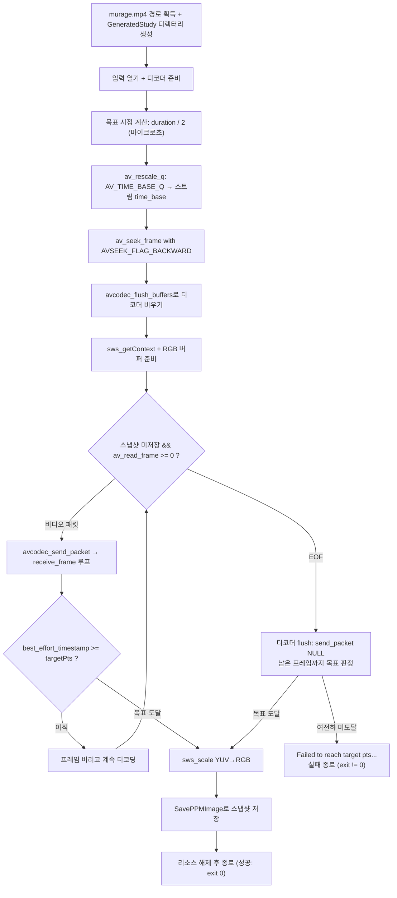

# 14. 시킹 (특정 시점으로 이동)

> 소스: `study-FFMPEG/14-seeking/main.c` · 타겟: `studyFFMPEG14Seeking` · [← 트랙 개요](README.md)

## 학습 목표

플레이어의 "탐색 바 드래그"가 내부에서 하는 일을 직접 구현한다. 영상 전체 길이의 50% 지점을 계산해 `av_seek_frame()`으로 이동하고, `avcodec_flush_buffers()`로 디코더를 비운 뒤, 키프레임부터 목표 pts까지 전진 디코딩해 그 순간의 프레임을 PPM 스냅샷으로 저장한다. 시킹이 왜 "키프레임 착지 + 전진 디코딩"의 2단계인지 이해한다.

## 핵심 개념

### 시킹의 3단계

| 단계 | API | 이유 |
|---|---|---|
| 1. 파일 위치 이동 | `av_seek_frame(..., AVSEEK_FLAG_BACKWARD)` | 목표 시점 **이전의 가장 가까운 키프레임**으로 이동. P/B 프레임은 키프레임 없이 디코딩할 수 없다 |
| 2. 디코더 비우기 | `avcodec_flush_buffers()` | 디코더 내부에 남은 시킹 이전 데이터를 제거. 안 하면 화면이 깨진다 |
| 3. 전진 디코딩 | receive_frame 루프에서 `pts >= targetPts`까지 버리며 디코딩 | 키프레임과 목표 사이의 프레임들을 순서대로 소비해야 목표 프레임이 올바르게 복원된다 |

### 왜 키프레임으로 가야 하나

압축 영상의 P/B 프레임은 "이전 프레임과의 차이"만 담고 있다. 목표 지점이 P 프레임이라면 그 프레임만 읽어서는 절대 복원할 수 없고, 반드시 직전 키프레임(I 프레임)부터 순서대로 디코딩해 와야 한다. `AVSEEK_FLAG_BACKWARD`가 목표 **이전** 키프레임으로 착지시키는 이유다. 이 플래그가 없으면 목표 **이후** 키프레임으로 갈 수 있어 원하는 지점을 지나쳐 버린다.

### 시간 단위 변환: AV_TIME_BASE_Q → 스트림 time_base

`AVFormatContext->duration`은 마이크로초 단위(`AV_TIME_BASE` = 1,000,000)지만, `av_seek_frame()`에 스트림 인덱스를 지정하면 타임스탬프는 **그 스트림의 time_base 단위**여야 한다. `av_rescale_q()`로 변환한다.

```c
targetPts = av_rescale_q(targetTimestampUs, AV_TIME_BASE_Q, pVideoStream->time_base);
```

### 실측으로 보는 시킹의 실제 동작

murage.mp4(12.78초)에서의 실행 결과:

| 항목 | 값 |
|---|---|
| 시킹 목표 | 6.39초 (pts=98138) |
| 실제 저장된 프레임 | pts=98304 (6.40초) |
| 키프레임 착지 후 디코딩한 프레임 수 | **13장** |

`av_seek_frame()`이 우리를 데려간 곳은 6.39초가 아니라 그보다 앞의 키프레임이다. 거기서 13번째 프레임에서야 `pts >= targetPts`가 성립한다 — 앞의 12장은 목표 프레임을 복원하기 위한 재료로만 쓰이고 버려진다. 시킹이 "순간이동"이 아니라 "가까운 정거장에 내려서 걸어가기"임을 숫자로 확인할 수 있다.

## 프로그램 흐름



## 핵심 API

| API / 구조체 | 역할 |
|---|---|
| `AVFormatContext->duration` | 파일 전체 길이 (AV_TIME_BASE = 마이크로초 단위) |
| `AV_TIME_BASE_Q` | `{1, 1000000}` 상수 — duration의 time_base |
| `av_rescale_q()` | 타임스탬프를 한 time_base에서 다른 time_base로 변환 (오버플로 안전) |
| `av_seek_frame()` | 지정 스트림의 타임스탬프 위치로 파일 읽기 포인터 이동 |
| `AVSEEK_FLAG_BACKWARD` | 목표 지점 "이전"의 키프레임으로 착지 |
| `avcodec_flush_buffers()` | 디코더 내부 버퍼 초기화 — 시킹의 필수 파트너 |
| `AVFrame->best_effort_timestamp` | 목표 도달 판정에 쓰는 신뢰도 높은 타임스탬프 |
| `av_q2d()` | time_base(AVRational)를 double 초 단위 계산에 사용 |

## 이전 레슨과의 차이

- 지금까지의 모든 레슨은 파일을 **처음부터 순서대로** 읽었다(순차 재생). 이 레슨에서 처음으로 **랜덤 액세스** — 원하는 시점으로 건너뛰는 방법을 배운다.
- `avcodec_flush_buffers()`가 처음 등장한다. 디코더가 상태를 가진(stateful) 컴포넌트라는 사실이 시킹에서 비로소 드러난다 — 순차 재생에서는 의식할 일이 없었다.
- 04에서 관찰만 하던 키프레임(I 프레임) 개념이 실질적 제약으로 작동한다: 시킹은 키프레임 단위로만 착지할 수 있다.
- RGB 변환(06) + PPM 저장(05)은 그대로 재사용한다.

## ⚠️ 알아두기

- `avcodec_flush_buffers()`를 빼먹으면 시킹 이전 위치의 참조 프레임이 디코더에 남아 시킹 직후 프레임들이 깨진(블록 노이즈) 화면으로 나온다. `av_seek_frame()`과 항상 짝으로 호출해야 한다.
- 목표 도달 판정에 `pFrame->pts` 대신 `best_effort_timestamp`를 쓴다. pts가 없는(`AV_NOPTS_VALUE`) 프레임과의 비교가 항상 거짓이 되어 목표를 지나치는 사고를 막는다.
- 정확히 pts=98138인 프레임은 존재하지 않는다(프레임은 이산적이다). `>=` 비교로 목표 이후 첫 프레임(pts=98304, 6.40초)을 잡는다.
- read 루프가 EOF로 끝났는데 스냅샷을 못 찾았다면, B-프레임 재정렬 지연으로 **디코더 내부에 남은 프레임**이 있을 수 있다. `avcodec_send_packet(ctx, NULL)`로 디코더를 flush해 남은 프레임까지 판정하고, 그래도 못 찾으면 실패 메시지와 함께 0이 아닌 종료 코드로 끝난다.

## 실행 방법

```bash
# 빌드 (저장소 루트에서)
cmake --build cmake-build-debug --target studyFFMPEG14Seeking
# 실행
./cmake-build-debug/study-FFMPEG/14-seeking/studyFFMPEG14Seeking
```

- **입력: `resources/murage.mp4`** (실행 경로에서 `/cmake` 문자열 앞부분을 잘라 `resources/`를 붙이는 방식이므로 `cmake-build-*` 아래에서 실행해야 경로 계산이 성공한다)
- 출력물: `resources/GeneratedStudy/study-seek-snapshot.ppm` (영상 50% 지점의 1280x720 스냅샷)
- 콘솔에 시킹 목표(6.39초)와 실제 도달 프레임(6.40초), 키프레임 이후 디코딩한 프레임 수(13장)가 출력된다.

---
→ 자세한 코드 해설: [코드 상세 해설](14-seeking-deep-dive.md)
