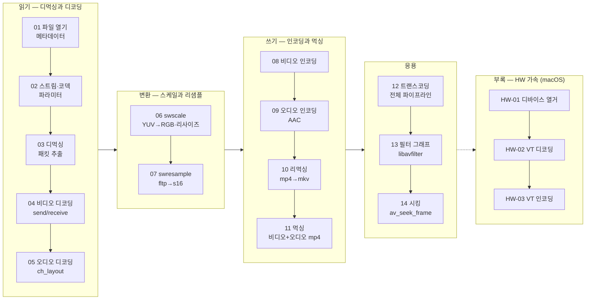

# study-FFMPEG — 처음부터 다시 배우는 FFmpeg 통합 트랙

기초(파일 열기)부터 고급(트랜스코딩·필터·시킹)까지 **FFmpeg 7.x C API를 이 트랙 하나로 완주**할 수 있도록 설계된 독립 커리큘럼이다. 기존 chapter01/02와 앞부분이 일부 겹치지만, 처음부터 최신 API 스타일(`av_find_best_stream`, `AVChannelLayout`, `swr_alloc_set_opts2`, flush 처리 등)로 다시 작성했고 모든 레슨이 실행 가능한 완결된 프로그램이다.

- **본편 01~14**: 읽기(디먹싱·디코딩) → 변환(swscale·swresample) → 쓰기(인코딩·먹싱) → 응용(트랜스코딩·필터·시킹) 순서로 진행한다.
- **부록 hw-accel 01~03**: macOS VideoToolbox 하드웨어 가속 디코딩/인코딩. 별도 파트로 분리되어 있으며 macOS에서만 빌드된다. → [부록 개요](hw-accel/README.md)

입력은 `resources/murage.mp4`(h264 1280x720 30fps + aac 48kHz stereo, 12.78초)이고, 생성물은 `resources/GeneratedStudy/`에 저장된다(프로그램이 디렉터리를 자동 생성한다).

## 학습 로드맵

## 레슨 목록 — 본편

| # | 레슨 | 주제 | 핵심 API | 문서 |
|---|---|---|---|---|
| 01 | 01-open-file | 컨테이너 열기·메타데이터·올바른 닫기 | `avformat_open_input`, `av_dump_format`, `av_dict_get` | [기본](01-open-file.md) · [딥다이브](01-open-file-deep-dive.md) |
| 02 | 02-stream-info | 스트림 순회, 코덱 파라미터, time_base 해석 | `AVCodecParameters`, `avcodec_find_decoder`, `av_q2d`, `AVChannelLayout` | [기본](02-stream-info.md) · [딥다이브](02-stream-info-deep-dive.md) |
| 03 | 03-demuxing-packets | 패킷 읽기 루프와 pts/dts/키프레임 관찰 | `av_read_frame`, `av_packet_unref`, `AV_PKT_FLAG_KEY`, `av_rescale_q` | [기본](03-demuxing-packets.md) · [딥다이브](03-demuxing-packets-deep-dive.md) |
| 04 | 04-decode-video | 비디오 디코딩 파이프라인 + flush | `av_find_best_stream`, `avcodec_send_packet`/`receive_frame` | [기본](04-decode-video.md) · [딥다이브](04-decode-video-deep-dive.md) |
| 05 | 05-decode-audio | 오디오 디코딩, 샘플 포맷, planar 이해 | `nb_samples`, `av_sample_fmt_is_planar`, `ch_layout` | [기본](05-decode-audio.md) · [딥다이브](05-decode-audio-deep-dive.md) |
| 06 | 06-scaling-video | 픽셀 포맷 변환 + 다운스케일, PPM 저장 | `sws_getContext`, `sws_scale`, `av_image_alloc` | [기본](06-scaling-video.md) · [딥다이브](06-scaling-video-deep-dive.md) |
| 07 | 07-resampling-audio | 샘플 포맷/레이트/레이아웃 변환, PCM 저장 | `swr_alloc_set_opts2`, `swr_convert`, `swr_get_delay` | [기본](07-resampling-audio.md) · [딥다이브](07-resampling-audio-deep-dive.md) |
| 08 | 08-encode-video | 합성 프레임 생성 → 비디오 인코딩 | `avcodec_send_frame`/`receive_packet`, `av_frame_make_writable` | [기본](08-encode-video.md) · [딥다이브](08-encode-video-deep-dive.md) |
| 09 | 09-encode-audio | 사인파 → AAC 인코딩(ADTS) | `frame_size`, `av_channel_layout_copy`, adts 먹서 | [기본](09-encode-audio.md) · [딥다이브](09-encode-audio-deep-dive.md) |
| 10 | 10-remuxing | 재인코딩 없는 컨테이너 변환 mp4→mkv | `avcodec_parameters_copy`, `av_packet_rescale_ts`, `av_interleaved_write_frame` | [기본](10-remuxing.md) · [딥다이브](10-remuxing-deep-dive.md) |
| 11 | 11-muxing | 비디오+오디오 두 스트림을 mp4로 먹싱 | `av_compare_ts`, `avcodec_parameters_from_context`, `AV_CODEC_FLAG_GLOBAL_HEADER` | [기본](11-muxing.md) · [딥다이브](11-muxing-deep-dive.md) |
| 12 | 12-transcoding | 디코드→스케일→재인코딩→먹싱 통합 | 03+04+06+08+11 통합, `best_effort_timestamp` | [기본](12-transcoding.md) · [딥다이브](12-transcoding-deep-dive.md) |
| 13 | 13-filtering-video | libavfilter 필터 그래프(hflip, drawbox) | `avfilter_graph_parse_ptr`, `av_buffersrc_add_frame_flags`, `av_buffersink_get_frame` | [기본](13-filtering-video.md) · [딥다이브](13-filtering-video-deep-dive.md) |
| 14 | 14-seeking | 특정 시점으로 이동해 스냅샷 추출 | `av_seek_frame`, `AVSEEK_FLAG_BACKWARD`, `avcodec_flush_buffers` | [기본](14-seeking.md) · [딥다이브](14-seeking-deep-dive.md) |

## 레슨 목록 — 부록 (hw-accel, macOS 전용)

| # | 레슨 | 주제 | 핵심 API | 문서 |
|---|---|---|---|---|
| HW-01 | hw-accel/01-list-hw-devices | HW 디바이스 타입 열거와 VideoToolbox 확인 | `av_hwdevice_iterate_types`, `av_hwdevice_ctx_create`, `avcodec_get_hw_config` | [기본](hw-accel/01-list-hw-devices.md) · [딥다이브](hw-accel/01-list-hw-devices-deep-dive.md) |
| HW-02 | hw-accel/02-hw-decode | VideoToolbox HW 디코딩과 GPU→CPU 전송 | `hw_device_ctx`, `get_format`, `av_hwframe_transfer_data` | [기본](hw-accel/02-hw-decode.md) · [딥다이브](hw-accel/02-hw-decode-deep-dive.md) |
| HW-03 | hw-accel/03-hw-encode | h264_videotoolbox HW 인코딩 트랜스코딩 | `avcodec_find_encoder_by_name("h264_videotoolbox")` | [기본](hw-accel/03-hw-encode.md) · [딥다이브](hw-accel/03-hw-encode-deep-dive.md) |

## 생성물 목록 (`resources/GeneratedStudy/`)

| 레슨 | 파일 | 확인 방법 |
|---|---|---|
| 06 | `study-scaled-000~004.ppm` | 미리보기 앱으로 열기 |
| 07 | `study-audio.pcm` | `ffplay -f s16le -ar 44100 -ch_layout stereo <파일>` |
| 08 | `study-encoded.m4v` (libx264 있으면 `.h264`) | `ffplay <파일>` |
| 09 | `study-encoded.aac` | `ffplay <파일>` |
| 10 | `study-remux.mkv` | `ffprobe <파일>` |
| 11 | `study-muxed.mp4` | `ffplay <파일>` |
| 12 | `study-transcoded.mp4` | `ffplay <파일>` (640x360 확인) |
| 13 | `study-filtered-000~004.ppm` | 미리보기 (좌우 반전 + 빨간 사각형) |
| 14 | `study-seek-snapshot.ppm` | 미리보기 (6.4초 지점 장면) |
| HW-02 | `study-hw-decoded.nv12` | `ffplay -f rawvideo -pixel_format nv12 -video_size 1280x720 <파일>` |
| HW-03 | `study-hw-encoded.mp4` | `ffplay <파일>` |

## 공통 사항

- 빌드/실행: 저장소 루트에서 `cmake --build cmake-build-debug --target <타겟명>` 후 `./cmake-build-debug/study-FFMPEG/<레슨 디렉터리>/<타겟명>` 실행. 리소스 경로를 실행 경로에서 역산하므로 **빌드 트리 안에서 실행**해야 한다.
- ⚠️ 이 저장소의 vcpkg FFmpeg 빌드에는 **libx264가 포함되어 있지 않아** 레슨 08/11/12는 MPEG-4 인코더로 폴백한다(코드에 폴백 처리 내장). HW 인코더 `h264_videotoolbox`는 사용 가능하다.
- 트랙 공통 코드 관례: `FFMPEG_ERROR` 매크로, `GetResourcePath()`/`EnsureGeneratedStudyDirectory()` 헬퍼, FFmpeg 7.x API만 사용(`avcodec_close` 금지, `ch_layout` 사용 등).

---
[← 전체 로드맵](../README.md) · [부록: hw-accel →](hw-accel/README.md)
