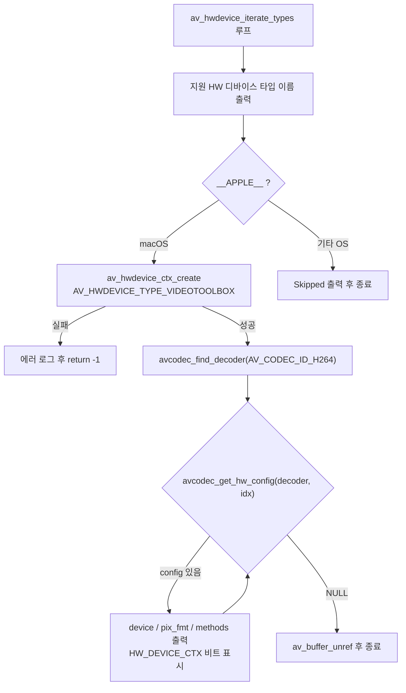

# 01. 하드웨어 디바이스 열거

> 소스: `study-FFMPEG/hw-accel/01-list-hw-devices/main.c` · 타겟: `studyFFMPEGHW01ListHwDevices` · [← 부록 개요](README.md)

## 학습 목표

파일을 열기 전에, 이 FFmpeg 빌드와 이 머신이 **어떤 하드웨어 가속을 지원하는지** 조사하는 방법을 익힌다. 지원 HW 디바이스 타입 열거(`av_hwdevice_iterate_types`), VideoToolbox 디바이스 컨텍스트 생성(`av_hwdevice_ctx_create`), 그리고 특정 디코더가 지원하는 HW 설정 조회(`avcodec_get_hw_config`)까지 — HW 디코딩(02)에 들어가기 전의 사전 점검이다.

## 핵심 개념

- **HW 디바이스 타입**: FFmpeg은 CUDA, VAAPI, DXVA2, VideoToolbox 등 플랫폼별 HW 가속 프레임워크를 `AVHWDeviceType` 열거형으로 추상화한다. 어떤 타입이 쓸 수 있는지는 **빌드 시점**에 결정된다 — `av_hwdevice_iterate_types()`는 이 빌드에 컴파일된 타입만 돌려준다.
- **AVHWDeviceContext 생성**: `av_hwdevice_ctx_create()`는 실제 디바이스를 열어 `AVBufferRef`로 감싼 디바이스 컨텍스트를 만든다. 빌드에 타입이 포함되어 있어도 실제 하드웨어가 없으면 여기서 실패하므로, "빌드 지원"과 "런타임 지원"을 구분하는 지점이다. VideoToolbox는 CUDA/VAAPI와 달리 디바이스 경로 지정이 필요 없어 세 번째 인자를 NULL로 준다.
- **AVCodecHWConfig**: 같은 디코더라도 여러 HW 방식을 지원할 수 있다. `avcodec_get_hw_config(decoder, i)`를 인덱스를 늘려가며 호출해 NULL이 나올 때까지 순회하면, 각 설정의 `device_type`(어떤 HW), `pix_fmt`(HW 픽셀 포맷), `methods`(연결 방식 비트마스크)를 알 수 있다.
- **AV_CODEC_HW_CONFIG_METHOD_HW_DEVICE_CTX**: `methods`에 이 비트가 켜져 있으면 `codecContext->hw_device_ctx`에 디바이스 컨텍스트를 걸어주는 것만으로 HW 디코딩이 가능하다는 뜻이다. 다음 레슨(02)이 바로 이 방식을 쓴다.

## 프로그램 흐름



## 핵심 API

| API / 구조체 | 역할 |
|---|---|
| `av_hwdevice_iterate_types()` | 이 빌드에 컴파일된 HW 디바이스 타입을 차례로 반환한다 (NONE으로 종료) |
| `av_hwdevice_get_type_name()` | `AVHWDeviceType`을 문자열 이름으로 변환한다 |
| `av_hwdevice_ctx_create()` | 실제 HW 디바이스를 열어 `AVBufferRef` 디바이스 컨텍스트를 만든다 |
| `avcodec_get_hw_config()` | 디코더의 i번째 `AVCodecHWConfig`를 반환한다 (없으면 NULL) |
| `AVCodecHWConfig->pix_fmt` | 이 HW 설정이 사용하는 HW 픽셀 포맷 (예: `videotoolbox_vld`) |
| `AVCodecHWConfig->methods` | HW 연결 방식 비트마스크 |
| `AV_CODEC_HW_CONFIG_METHOD_HW_DEVICE_CTX` | `hw_device_ctx` 필드로 디바이스를 걸어주는 방식 지원 |
| `av_buffer_unref()` | 디바이스 컨텍스트(`AVBufferRef`)의 참조를 해제한다 |

## 이전 레슨과의 차이

- 본편 레슨들(01~14)은 모두 미디어 파일을 열어 처리했지만, 이 레슨은 **파일을 전혀 열지 않는다**. `AVFormatContext`도 `AVPacket`도 없이 시스템의 HW 가속 능력만 조사한다.
- 본편에서 코덱을 찾을 때 쓰던 `avcodec_find_decoder()`를 여기서는 "디코더 객체에서 HW 설정을 읽는" 용도로 재사용한다.

## ⚠️ 알아두기

- macOS arm64 vcpkg 빌드에서 실측한 지원 타입은 **`videotoolbox` 하나뿐**이다. CUDA/VAAPI 등은 이 빌드에 컴파일되어 있지 않다.
- H.264 디코더의 HW 설정도 하나만 나온다 — `config #0 : device=videotoolbox, pix_fmt=videotoolbox_vld, methods=0xb [HW_DEVICE_CTX]`. `methods=0xb`에 `HW_DEVICE_CTX` 비트가 포함되어 있으므로 02 레슨의 방식이 유효함을 확인할 수 있다.
- `av_hwdevice_ctx_create()`로 만든 컨텍스트는 `AVBufferRef`이므로 `av_buffer_unref()`로 해제한다 — `av_free()`가 아니다.

## 실행 방법

```bash
# 빌드 (저장소 루트에서)
cmake --build cmake-build-debug --target studyFFMPEGHW01ListHwDevices
# 실행
./cmake-build-debug/study-FFMPEG/hw-accel/01-list-hw-devices/studyFFMPEGHW01ListHwDevices
```

- 입력/출력물: 파일 없음. 콘솔에 지원 HW 디바이스 타입 목록(`videotoolbox`), 디바이스 생성 성공 메시지, H.264 디코더의 HW config 목록이 출력된다.

---
→ 자세한 코드 해설: [코드 상세 해설](01-list-hw-devices-deep-dive.md)
