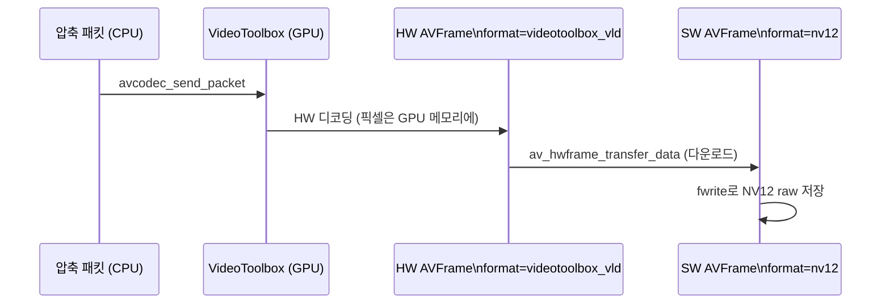

# 02. VideoToolbox 하드웨어 디코딩 — 코드 상세 해설

> [← 기본 문서](02-hw-decode.md)

## 전체 구조

`main()`이 본편 04와 같은 디코딩 골격을 유지하고, HW 관련 코드가 두 개의 static 함수로 분리되어 있다. 파일 전체가 `#if defined(__APPLE__)` 가드 아래에 있다.

| 구성 요소 | 역할 |
|---|---|
| `main()` | 디바이스 생성 → 입력/디코더 준비 → HW 설정 → 디코딩 루프 → flush → 시간 출력 |
| `GetHwPixelFormat()` | `get_format` 콜백 — HW 포맷 선택 + SW 폴백 |
| `SaveHwFrameToFile()` | GPU 프레임을 CPU로 내려 NV12 raw 파일로 저장 |
| `EnsureGeneratedStudyDirectory()` / `GetResourcePath()` | 출력 디렉터리 생성 / 리소스 경로 계산 (본편과 공통) |

## 코드 블록별 해설

### 1. VideoToolbox 디바이스 생성 — 실패해도 정상 종료

```c
/** ===== 1. VideoToolbox 디바이스 생성 ===== */
errorCode = av_hwdevice_ctx_create(&pHwDeviceContext, AV_HWDEVICE_TYPE_VIDEOTOOLBOX, NULL, NULL, 0);
if (errorCode < 0) {
    av_log(NULL, AV_LOG_ERROR, "[FFMPEG ERROR](%d) Failed Create VideoToolbox Device...\r\n", errorCode);
    printf("HW acceleration not available on this machine.\r\n");
    return 0;
}
```

01 레슨과 같은 호출이지만 실패 처리 방식이 다르다 — `return -1`이 아니라 **return 0**이다. HW 가속 부재는 "이 프로그램의 버그"가 아니라 "이 머신의 특성"이므로, 안내만 하고 정상 종료하는 것이 관례다.

디바이스 생성 **이후**의 입력 열기는 `FFMPEG_ERROR` 매크로 대신 명시적 검사 + `goto`를 쓴다.

```c
/** ===== 2. 입력 + 디코더 준비 ===== */
/** 이미 만든 HW 디바이스 컨텍스트가 누수되지 않도록 매크로 대신 goto 정리 경로를 쓴다 */
errorCode = avformat_open_input(&pFormatContext, resourcePath, NULL, NULL);
if (errorCode != 0) {
    av_log(NULL, AV_LOG_ERROR, "[FFMPEG ERROR](%d) FFMPEG Open Failed...\r\n", errorCode);
    goto ffmpeg_release;
}
```

`FFMPEG_ERROR` 매크로는 `return -1`을 하므로, 이 시점에 이미 살아 있는 `pHwDeviceContext`의 `av_buffer_unref()`를 건너뛰어 VideoToolbox 디바이스가 누수된다. `goto ffmpeg_release`로 빠지면 정리 경로가 디바이스 참조까지 해제해 준다.

### 2. `av_find_best_stream` — 스트림과 디코더를 한 번에

```c
videoStreamIdx = av_find_best_stream(pFormatContext, AVMEDIA_TYPE_VIDEO, -1, -1, &pVideoCodec, 0);
if (videoStreamIdx < 0) {
    av_log(NULL, AV_LOG_ERROR, "[FFMPEG ERROR](%d) Video Stream Found Failed...\r\n", videoStreamIdx);
    goto ffmpeg_release;
}
```

본편 초반 레슨들의 "전체 스트림 순회 + codec_id로 디코더 탐색"을 한 줄로 대체한다. 다섯 번째 인자에 `&pVideoCodec`을 주면 해당 스트림에 맞는 디코더까지 함께 받는다. 실패 시 음수를 반환하므로 그대로 인덱스 검사에 쓸 수 있다.

### 3. HW 디코딩 설정 — SW 디코딩과 다른 유일한 부분

```c
/**
 * ===== 3. HW 디코딩 설정 (SW 디코딩과 다른 유일한 부분) =====
 * hw_device_ctx: 이 디코더가 사용할 HW 디바이스 (참조 카운트 증가시켜 전달)
 * get_format   : 디코더가 SW/HW 포맷 중 무엇을 쓸지 물어볼 때의 답변 콜백
 */
pVideoCodecContext->hw_device_ctx = av_buffer_ref(pHwDeviceContext);
pVideoCodecContext->get_format = GetHwPixelFormat;

errorCode = avcodec_open2(pVideoCodecContext, pVideoCodec, NULL);
```

이 두 줄이 이 레슨의 핵심이다.

- `av_buffer_ref(pHwDeviceContext)`: 디바이스 컨텍스트의 참조 카운트를 1 올린 **새 참조**를 만들어 코덱 컨텍스트에 준다. 이후 `avcodec_free_context()`가 자기 참조를, `main`의 `av_buffer_unref()`가 원본 참조를 각각 내리면 마지막에 실제 디바이스가 정리된다. `pVideoCodecContext->hw_device_ctx = pHwDeviceContext;`처럼 직접 대입하면 이중 해제가 일어난다.
- `get_format` 콜백 지정은 반드시 `avcodec_open2()` **이전**이어야 한다. 콜백 자체는 open 시점이 아니라 첫 패킷을 디코딩하면서 스트림 파라미터가 확정될 때 불린다.

### 4. `GetHwPixelFormat` — HW 선택과 SW 폴백

```c
static enum AVPixelFormat GetHwPixelFormat(AVCodecContext *pCodecContext, const enum AVPixelFormat *pPixelFormats) {
    /**
     * 디코더가 제안하는 포맷 목록(AV_PIX_FMT_NONE으로 끝남)에서
     * VideoToolbox GPU 포맷이 있으면 그것을 고른다.
     * 없으면(HW 초기화 실패 등) 첫 번째 SW 포맷으로 폴백한다.
     */
    for (const enum AVPixelFormat *pFormat = pPixelFormats; *pFormat != AV_PIX_FMT_NONE; pFormat++) {
        if (*pFormat == AV_PIX_FMT_VIDEOTOOLBOX) {
            return *pFormat;
        }
    }
    printf("VideoToolbox pixel format not offered → SW decoding fallback\r\n");
    return pPixelFormats[0];
}
```

디코더는 `AV_PIX_FMT_NONE`으로 끝나는 후보 배열을 넘긴다. 01 레슨에서 본 `pix_fmt=videotoolbox_vld`가 바로 이 목록에 `AV_PIX_FMT_VIDEOTOOLBOX`로 나타나는 값이다. 목록에 HW 포맷이 없다면(HW 세션 초기화 실패, 지원하지 않는 프로파일 등) 첫 번째 후보 — 관례상 가장 선호되는 SW 포맷 — 를 돌려줘서 디코딩 자체는 계속되게 한다. HW를 강제하고 싶다면 여기서 `AV_PIX_FMT_NONE`을 반환해 디코딩을 실패시키는 방법도 있다.

### 5. 디코딩 루프 — 프레임 포맷 확인

```c
decodedFrameCount++;

/** 첫 프레임: GPU 메모리 여부 확인 후 CPU로 내려 저장 */
if (!firstFrameSaved) {
    printf("frame format : %s %s\r\n",
           av_get_pix_fmt_name((enum AVPixelFormat) pFrame->format),
           pFrame->format == AV_PIX_FMT_VIDEOTOOLBOX ? "(GPU memory!)" : "(sw fallback)");
    if (pFrame->format == AV_PIX_FMT_VIDEOTOOLBOX) {
        firstFrameSaved = SaveHwFrameToFile(pFrame, outputPath);
    } else {
        firstFrameSaved = true;
    }
}
av_frame_unref(pFrame);
```

받은 프레임의 `format` 필드로 HW 경로가 실제로 켜졌는지 런타임에 확인한다. 실측 출력은 `frame format : videotoolbox_vld (GPU memory!)` — 이 프레임의 `data[3]`에는 CVPixelBufferRef가 들어 있고, CPU에서 픽셀을 직접 읽을 수 없다. 콜백에서 SW 폴백이 일어났다면 `nv12`나 `yuv420p` 같은 이름이 나왔을 것이다.

### 6. `SaveHwFrameToFile` — GPU→CPU 전송과 NV12 저장 (핵심)

```c
/**
 * GPU 메모리 → CPU 메모리 전송.
 * 출력 포맷을 지정하지 않으면(0) FFmpeg이 적절한 SW 포맷(보통 NV12)을 고른다.
 */
errorCode = av_hwframe_transfer_data(pSwFrame, pHwFrame, 0);
if (errorCode < 0) {
    av_log(NULL, AV_LOG_ERROR, "[FFMPEG ERROR](%d) Failed Transfer HW Frame...\r\n", errorCode);
    av_frame_free(&pSwFrame);
    return false;
}

printf("transferred to CPU : %s %dx%d\r\n",
       av_get_pix_fmt_name((enum AVPixelFormat) pSwFrame->format),
       pSwFrame->width, pSwFrame->height);
```

`av_hwframe_transfer_data(dst, src, flags)`는 방향을 프레임 포맷으로 판단한다 — src가 HW 프레임이면 다운로드, dst가 HW 프레임이면 업로드다. dst의 `format`을 미리 지정하지 않으면 FFmpeg이 HW 프레임의 네이티브 표현과 가장 가까운 SW 포맷을 고르는데, VideoToolbox의 8비트 H.264는 **NV12**다. 실측: `transferred to CPU : nv12 1280x720`.

전송 결과가 NV12가 아닐 수도 있으므로, 저장 전에 포맷을 검사한다.

```c
/**
 * 아래 저장 코드는 NV12(2평면: Y + 인터리브 CbCr) 레이아웃 전용이다.
 * 10bit 소스(p010le) 등 다른 포맷으로 전송되면 레이아웃이 달라 파일이 깨지므로
 * NV12가 아닐 때는 저장을 건너뛴다.
 */
if (pSwFrame->format != AV_PIX_FMT_NV12) {
    printf("unexpected sw format (%s) — skip raw dump (NV12 전용 저장 코드)\r\n",
           av_get_pix_fmt_name((enum AVPixelFormat) pSwFrame->format));
    av_frame_free(&pSwFrame);
    return true;
}
```

10비트 HEVC(HDR) 같은 소스는 `p010le`로 내려와 평면 레이아웃과 바이트 폭이 NV12와 다르다. 그런 데이터를 NV12 가정 그대로 쓰면 깨진 파일이 만들어지므로, raw 덤프만 건너뛰고 `true`를 반환해 디코딩 자체는 계속 진행한다.

```c
/** NV12: Y 평면(전체 크기) + CbCr 인터리브 평면(세로 절반) */
for (int y = 0; y < pSwFrame->height; ++y) {
    fwrite(pSwFrame->data[0] + (ptrdiff_t) y * pSwFrame->linesize[0], 1, pSwFrame->width, pOutputFile);
}
for (int y = 0; y < pSwFrame->height / 2; ++y) {
    fwrite(pSwFrame->data[1] + (ptrdiff_t) y * pSwFrame->linesize[1], 1, pSwFrame->width, pOutputFile);
}
```

NV12는 평면이 두 개다 — `data[0]`은 Y(휘도, 픽셀당 1바이트, 세로 height줄), `data[1]`은 Cb/Cr이 바이트 단위로 인터리브된 색차 평면(가로 해상도는 절반이지만 2바이트씩이라 한 줄이 width 바이트, 세로는 height/2줄). 본편의 그레이스케일 저장에서 배운 것과 같은 원칙으로, `linesize`는 정렬 패딩을 포함할 수 있으므로 **줄 단위로 width 바이트만** 파일에 쓴다. 그래서 raw 파일이 정확히 `1280*720*1.5` 바이트가 되고, ffplay에 크기와 포맷만 알려주면 재생된다.

### 7. flush와 성능 출력

```c
/** 디코더 flush */
errorCode = avcodec_send_packet(pVideoCodecContext, NULL);
if (errorCode >= 0) {
    while (avcodec_receive_frame(pVideoCodecContext, pFrame) >= 0) {
        decodedFrameCount++;
        av_frame_unref(pFrame);
    }
}

elapsedSeconds = (double) (clock() - startClock) / CLOCKS_PER_SEC;
printf("decoded frames : %d in %.3f sec (CPU time) → %.1f fps\r\n",
       decodedFrameCount, elapsedSeconds,
       elapsedSeconds > 0 ? decodedFrameCount / elapsedSeconds : 0.0);
```

NULL 패킷으로 디코더 내부에 남은 프레임까지 모두 꺼내야 383프레임이 정확히 세어진다. `clock()`은 **프로세스 CPU 시간**이므로, GPU가 디코딩하는 동안 CPU가 대기한 시간은 포함되지 않는다. 실측 `383 in 0.091 sec → 4221 fps`는 "CPU가 거의 일하지 않았다"는 의미다. 벽시계 시간으로 재면(예: `gettimeofday`) GPU 처리 시간이 포함되어 수치가 더 낮게 나온다.

### 8. 자원 해제

```c
exitStatus = 0;

ffmpeg_release:
av_frame_free(&pFrame);
av_packet_free(&pPacket);
avcodec_free_context(&pVideoCodecContext);
avformat_close_input(&pFormatContext);
av_buffer_unref(&pHwDeviceContext);
if (exitStatus == 0) {
    printf("HW Decode Done!\r\n");
} else {
    printf("Finished with error(s)...\r\n");
}
return exitStatus;
```

`avcodec_free_context()`가 코덱 컨텍스트에 걸린 `hw_device_ctx` 참조를 내리고, 마지막의 `av_buffer_unref()`가 `main`이 쥔 원본 참조를 내린다. 두 참조가 모두 사라져야 VideoToolbox 디바이스가 실제로 정리된다.

`exitStatus`는 `-1`로 시작해 성공 경로 끝에서만 `0`으로 바뀐다. 에러로 `goto ffmpeg_release`를 타면 `-1`인 채 0이 아닌 종료 코드로 끝나므로 셸/CI에서 실패를 감지할 수 있다. (HW 디바이스 자체가 없는 경우는 예외적으로 초반에 `return 0`으로 정상 종료한다.)

## 심화: 프레임의 여행 — GPU와 CPU 사이



GPU→CPU 전송은 공짜가 아니다 — 프레임당 수 MB의 복사가 일어난다. 그래서 이 레슨은 **첫 프레임만** 내려받고 나머지는 개수만 센다. 실전에서 디코딩 결과를 다시 GPU 기반 렌더러(Metal 등)나 HW 인코더로 넘긴다면 전송 없이 GPU 메모리 안에서 처리하는 것이 이상적이다.

## ⚠️ 코드 특이점 상세

1. **`receive_frame`의 일반 에러도 조용히 break**
   `EAGAIN`/`EOF`가 아닌 음수 에러(`errorCode < 0`)도 로그 없이 내부 루프만 탈출한다. 바깥 `while (av_read_frame...)`은 계속 돌므로 손상 패킷 하나로 전체가 멈추지는 않지만, 반복 실패 시 원인을 알기 어렵다.

2. **SW 폴백 시 프레임을 저장하지 않음**
   폴백 프레임은 이미 CPU 메모리에 있으므로 그대로 저장할 수도 있지만, 이 레슨의 목적이 "GPU 프레임 다루기"라서 `firstFrameSaved = true`로 표시만 하고 넘어간다.

3. **출력 파일명이 고정**
   `study-hw-decoded.nv12` 하나로 고정되어 있어 재실행하면 덮어쓴다. 본편의 이미지 저장 레슨들과 같은 패턴이다.

4. **`(void) argc / argv` 처리가 없음**
   미사용 인자 경고가 나올 수 있으나 동작에는 무관하다.
