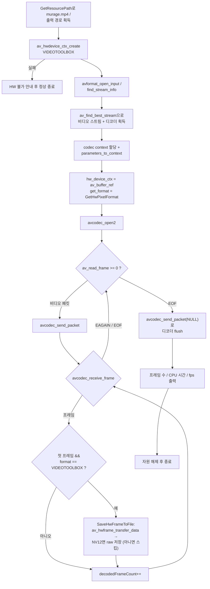

# 02. VideoToolbox 하드웨어 디코딩

> 소스: `study-FFMPEG/hw-accel/02-hw-decode/main.c` · 타겟: `studyFFMPEGHW02HwDecode` · [← 부록 개요](README.md)

## 학습 목표

본편 04의 SW 디코딩 골격을 그대로 두고 **딱 세 가지**만 바꿔 VideoToolbox HW 디코딩으로 전환한다: (1) `hw_device_ctx`에 디바이스 걸기, (2) `get_format` 콜백에서 HW 픽셀 포맷 선택, (3) GPU 메모리의 프레임을 `av_hwframe_transfer_data()`로 CPU에 내려받기. 전체 프레임을 디코딩해 CPU 시간을 측정하고, 첫 프레임을 raw NV12 파일로 저장한다.

## 핵심 개념

- **`hw_device_ctx` 연결**: 01 레슨에서 확인한 `HW_DEVICE_CTX` 방식이다. `avcodec_open2()` 전에 `codecContext->hw_device_ctx = av_buffer_ref(디바이스)`로 걸어주면 디코더가 HW 경로를 시도한다. `av_buffer_ref()`로 참조 카운트를 올려 전달하므로, 원본과 코덱 컨텍스트가 각자 독립적으로 해제해도 안전하다.
- **`get_format` 콜백**: 디코더가 "이 스트림은 이런 포맷들로 디코딩할 수 있는데 뭘 줄까?"라고 물어보는 지점. 제안 목록(NONE으로 끝나는 배열)에 `AV_PIX_FMT_VIDEOTOOLBOX`가 있으면 그것을 고르고, 없으면 첫 SW 포맷으로 **폴백**한다 — HW가 안 되는 환경에서도 프로그램이 죽지 않는 안전망이다.
- **GPU 프레임**: HW 디코딩된 프레임은 `format == AV_PIX_FMT_VIDEOTOOLBOX`이고 픽셀 데이터가 GPU 메모리(CVPixelBuffer)에 있다. `data[0]`을 그레이스케일 저장하듯 직접 읽으면 안 된다.
- **`av_hwframe_transfer_data()`**: GPU 프레임을 CPU의 SW 프레임으로 복사한다. 출력 포맷을 지정하지 않으면 FFmpeg이 적절한 포맷을 고르는데, VideoToolbox는 보통 **NV12**(Y 평면 + CbCr 인터리브 평면)다. 저장 코드는 NV12 레이아웃 전용이므로, 전송 결과가 NV12가 아니면(10bit 소스의 `p010le` 등) raw 덤프는 건너뛴다.
- **CPU 시간 측정**: `clock()`은 벽시계가 아니라 **이 프로세스가 CPU를 쓴 시간**을 잰다. HW 디코딩은 실제 작업을 GPU가 하므로 CPU 시간이 극단적으로 작게 나온다 (실측: 383프레임을 CPU 시간 0.091초에 → 4221 fps).

## 프로그램 흐름



## 핵심 API

| API / 구조체 | 역할 |
|---|---|
| `av_hwdevice_ctx_create()` | VideoToolbox 디바이스 컨텍스트 생성 |
| `AVCodecContext->hw_device_ctx` | 디코더가 사용할 HW 디바이스 (`av_buffer_ref()`로 전달) |
| `AVCodecContext->get_format` | SW/HW 픽셀 포맷 선택 콜백 |
| `AV_PIX_FMT_VIDEOTOOLBOX` | VideoToolbox GPU 메모리 프레임을 뜻하는 HW 픽셀 포맷 |
| `av_find_best_stream()` | 최적 스트림 인덱스와 디코더를 한 번에 찾는다 |
| `av_hwframe_transfer_data()` | GPU 프레임 → CPU SW 프레임(NV12) 전송 |
| `AVFrame->linesize` | 평면별 한 줄의 바이트 수 (정렬 패딩 포함, width와 다를 수 있음) |
| `clock()` / `CLOCKS_PER_SEC` | 프로세스 CPU 시간 측정 |

## 이전 레슨과의 차이

- 01 레슨은 HW 능력을 조사만 했지만, 이번에는 실제로 `murage.mp4`를 열어 HW 디코딩한다.
- 본편 04(SW 디코딩)와 비교하면 골격(열기 → 스트림 탐색 → 코덱 준비 → send/receive 루프 → flush)은 동일하고, **`avcodec_open2()` 직전의 두 줄**(`hw_device_ctx`, `get_format`)과 **GPU→CPU 전송 함수** 하나가 추가된 것이 전부다.
- 스트림 탐색이 수동 순회 대신 `av_find_best_stream()` 한 번으로 끝난다 — 디코더까지 함께 받아온다.

## ⚠️ 알아두기

- HW 디바이스 생성에 실패하면 에러가 아니라 **정상 종료(return 0)** 한다. HW가 없는 머신에서 CI 등이 깨지지 않게 하려는 의도다.
- `get_format` 폴백이 발동해 SW 포맷이 선택되면 프레임 저장은 건너뛰고 개수만 센다(`(sw fallback)` 출력).
- `av_hwframe_transfer_data()` 결과가 **NV12가 아니면 raw 저장을 건너뛴다**. 저장 코드가 NV12 2평면 레이아웃 전용이라, 10bit 소스처럼 `p010le`로 내려오는 경우 그대로 쓰면 깨진 파일이 되기 때문이다.
- HW 디바이스 생성 이후의 에러는 `FFMPEG_ERROR` 매크로(`return -1`) 대신 `goto ffmpeg_release`로 처리해, 이미 만든 VideoToolbox 디바이스 컨텍스트가 누수되지 않게 한다.
- NV12 raw 저장 시 `linesize`(정렬 패딩 포함)가 아니라 **width만큼만** 줄 단위로 써야 ffplay에서 올바르게 보인다.
- `clock()`은 CPU 시간이므로 "4221 fps"는 실제 재생 속도가 아니라 **CPU 부하 관점의 처리량**이다. GPU가 일하는 동안 CPU는 대부분 대기한다.

## 실행 방법

```bash
# 빌드 (저장소 루트에서)
cmake --build cmake-build-debug --target studyFFMPEGHW02HwDecode
# 실행
./cmake-build-debug/study-FFMPEG/hw-accel/02-hw-decode/studyFFMPEGHW02HwDecode
```

- **입력: `resources/murage.mp4`** (실행 경로에서 `/cmake` 문자열 앞부분을 잘라 `resources/`를 붙이는 방식이므로 `cmake-build-*` 아래에서 실행해야 경로 계산이 성공한다)
- 출력물: `resources/GeneratedStudy/study-hw-decoded.nv12` (첫 프레임 raw NV12). 콘솔에 `frame format : videotoolbox_vld (GPU memory!)`, `transferred to CPU : nv12 1280x720`, 그리고 `decoded frames : 383 in 0.091 sec (CPU time) → 4221 fps`가 출력된다.
- 저장된 raw 프레임 확인:

```bash
ffplay -f rawvideo -pixel_format nv12 -video_size 1280x720 resources/GeneratedStudy/study-hw-decoded.nv12
```

---
→ 자세한 코드 해설: [코드 상세 해설](02-hw-decode-deep-dive.md)
