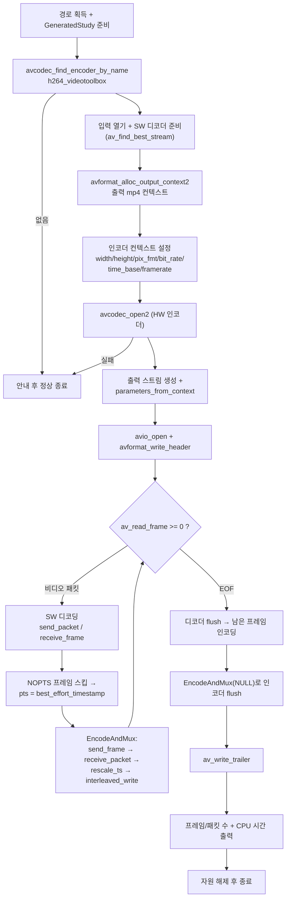

# 03. VideoToolbox 하드웨어 인코딩

> 소스: `study-FFMPEG/hw-accel/03-hw-encode/main.c` · 타겟: `studyFFMPEGHW03HwEncode` · [← 부록 개요](README.md)

## 학습 목표

`murage.mp4`를 SW 디코딩한 뒤 **`h264_videotoolbox` HW 인코더**로 재인코딩해 mp4로 저장한다. 본편 12(트랜스코딩)와 같은 구조(디코딩 → 인코딩 → 먹싱)에서 인코더만 HW로 바꾼 버전이다. HW 인코더가 SW 프레임을 직접 받아 내부에서 GPU로 올리기 때문에, `hw_frames_ctx` 같은 추가 설정 없이 SW 인코더와 거의 같은 코드로 쓸 수 있다는 것을 확인한다.

## 핵심 개념

- **이름으로 인코더 찾기**: HW 인코더는 코덱 ID로는 구분되지 않는다(`AV_CODEC_ID_H264`의 기본 인코더는 SW). `avcodec_find_encoder_by_name("h264_videotoolbox")`처럼 **구현체 이름**으로 찾아야 한다. NULL이 반환되면 이 빌드에 없는 것이다.
- **SW 프레임 직접 공급**: 디코딩(02)에서는 `hw_device_ctx`와 `get_format` 콜백이 필요했지만, `h264_videotoolbox` 인코더는 `pix_fmt`에 SW 포맷(YUV420P/NV12)을 그대로 지정하면 **인코더가 내부에서 GPU 업로드까지 처리**한다. 그래서 이 레슨에는 HW 컨텍스트 코드가 한 줄도 없다.
- **인코딩 파이프라인**: 디코딩의 send/receive를 뒤집은 대칭 구조다 — `avcodec_send_frame()`으로 비압축 프레임을 넣고 `avcodec_receive_packet()`으로 압축 패킷을 꺼낸다. `EAGAIN`/`AVERROR_EOF` 처리도 동일하다.
- **타임스탬프 체인**: 인코더 `time_base`를 입력 스트림 것으로 맞춰 디코딩된 프레임의 `best_effort_timestamp`를 그대로 pts로 쓰고, 먹싱 직전에 `av_packet_rescale_ts()`로 출력 스트림 time_base로 변환한다. `best_effort_timestamp`가 `AV_NOPTS_VALUE`인 프레임은 먹싱 에러를 일으키므로 건너뛴다.
- **flush 순서**: 디코더 flush(NULL 패킷) → 남은 프레임 인코딩 → 인코더 flush(NULL 프레임) → `av_write_trailer()`. 순서가 어긋나면 마지막 프레임들이 유실된다.

## 프로그램 흐름



## 핵심 API

| API / 구조체 | 역할 |
|---|---|
| `avcodec_find_encoder_by_name()` | 구현체 이름(`h264_videotoolbox`)으로 인코더를 찾는다 |
| `avformat_alloc_output_context2()` | 출력 파일 확장자로 먹서(mp4)를 골라 출력 컨텍스트를 만든다 |
| `avcodec_send_frame()` / `avcodec_receive_packet()` | 인코딩 파이프라인 (디코딩의 대칭) |
| `av_guess_frame_rate()` | 스트림 정보에서 프레임레이트를 추정한다 |
| `AV_CODEC_FLAG_GLOBAL_HEADER` | mp4처럼 전역 헤더가 필요한 포맷을 위한 인코더 플래그 |
| `avcodec_parameters_from_context()` | 인코더 설정을 출력 스트림 `codecpar`로 복사한다 |
| `av_packet_rescale_ts()` | 패킷의 pts/dts/duration을 다른 time_base로 변환한다 |
| `av_interleaved_write_frame()` | 패킷을 인터리브 순서를 지켜 먹서에 쓴다 |
| `av_write_trailer()` | 파일 꼬리(인덱스 등)를 써서 컨테이너를 완성한다 |

## 이전 레슨과의 차이

- 02는 HW **디코딩**(입력 쪽 가속)이었고, 이번에는 HW **인코딩**(출력 쪽 가속)이다. 디코딩은 이 레슨에서 일부러 SW로 남겨, HW 인코더의 효과만 분리해 본다.
- 02에서 필요했던 `hw_device_ctx` / `get_format` / `av_hwframe_transfer_data`가 **전부 없다**. `h264_videotoolbox`가 SW 프레임을 직접 받아주기 때문으로, HW 디코딩과 HW 인코딩의 API 사용 난이도가 비대칭임을 보여준다.
- 본편 12(트랜스코딩)와 구조가 같지만 스케일링(`sws_scale`) 단계가 없고, 인코더가 `h264_videotoolbox`다.

## ⚠️ 알아두기

- 이 vcpkg 빌드에는 `libx264`가 없어 본편 08/12는 MPEG-4 폴백을 쓰지만, **`h264_videotoolbox`는 사용 가능**하다 — Apple 프레임워크를 링크만 하면 되고 GPL 라이선스 문제도 없기 때문이다.
- 인코더가 빌드에 없으면 안내 후 **정상 종료(return 0)** 한다(02와 같은 방침). 반면 인코더는 있는데 **열기에 실패**하면 자원을 정리한 뒤 0이 아닌 종료 코드로 끝난다.
- 디코딩된 프레임 중 `best_effort_timestamp`가 `AV_NOPTS_VALUE`인 프레임은 인코더에 넣지 않고 **건너뛴다**(메인 루프와 디코더 flush 루프 모두). 그대로 먹싱하면 `non monotonically increasing dts` 에러로 기록이 끊기기 때문이다.
- 실측 CPU 시간은 1.59초(383프레임 → 240.8 fps)로, HW 디코딩(0.091초)보다 크다. 여기에는 SW 디코딩 + 프레임 복사 + 먹싱의 CPU 비용이 포함되어 있고, 인코딩 자체는 GPU가 수행한다.
- `bit_rate = 2000000`(2 Mbps) 고정이다. VideoToolbox 인코더는 libx264의 CRF 같은 품질 모드 대신 비트레이트 중심으로 동작한다.

## 실행 방법

```bash
# 빌드 (저장소 루트에서)
cmake --build cmake-build-debug --target studyFFMPEGHW03HwEncode
# 실행
./cmake-build-debug/study-FFMPEG/hw-accel/03-hw-encode/studyFFMPEGHW03HwEncode
```

- **입력: `resources/murage.mp4`** (실행 경로에서 `/cmake` 문자열 앞부분을 잘라 `resources/`를 붙이는 방식이므로 `cmake-build-*` 아래에서 실행해야 경로 계산이 성공한다)
- 출력물: `resources/GeneratedStudy/study-hw-encoded.mp4` (H.264, 2 Mbps). 콘솔에 `encoded frames : 383 → written packets : 383`, `elapsed : 1.59 sec (CPU time) → 240.8 fps`가 출력된다.
- 결과 재생 확인:

```bash
ffplay resources/GeneratedStudy/study-hw-encoded.mp4
```

---
→ 자세한 코드 해설: [코드 상세 해설](03-hw-encode-deep-dive.md)
