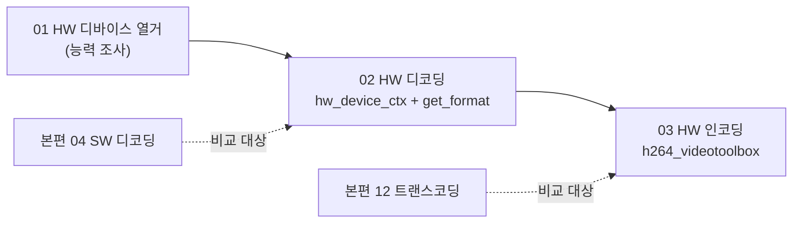

# 부록 — VideoToolbox 하드웨어 가속 (hw-accel)

study-FFMPEG 본편에서 다룬 디코딩(04)·인코딩(08)·트랜스코딩(12)을 **GPU 하드웨어 가속**으로 다시 해보는 부록 트랙이다. macOS/iOS의 HW 코덱 프레임워크인 **VideoToolbox**를 사용해, "HW 능력 조사 → HW 디코딩 → HW 인코딩" 순으로 FFmpeg 하드웨어 가속 API를 익힌다.

## VideoToolbox란

VideoToolbox는 Apple이 제공하는 저수준 HW 코덱 프레임워크로, Mac/iPhone의 SoC에 내장된 전용 인코더/디코더 블록(Apple Silicon의 미디어 엔진 등)에 접근한다. CPU가 아닌 전용 하드웨어가 압축/해제를 수행하므로 **CPU 시간이 크게 줄고**(02 레슨 실측: 383프레임 디코딩에 CPU 시간 0.091초), 배터리 소모도 적다. FFmpeg은 이를 `videotoolbox` HW 디바이스 타입과 `h264_videotoolbox` 같은 전용 인코더로 감싸 제공한다.

## FFmpeg HW 가속 핵심 개념

- **AVHWDeviceContext**: HW 디바이스(GPU/코덱 블록)를 대표하는 컨텍스트. `av_hwdevice_ctx_create()`로 만들며, `AVBufferRef`로 참조 카운트되어 여러 코덱 컨텍스트가 공유할 수 있다.
- **`codecContext->hw_device_ctx`**: 디코더에 "이 HW 디바이스를 써라"라고 걸어주는 필드. `av_buffer_ref()`로 참조를 늘려 전달한다. 이 방식이 `AV_CODEC_HW_CONFIG_METHOD_HW_DEVICE_CTX`다.
- **`get_format` 콜백**: 디코더가 열릴 때 "SW/HW 픽셀 포맷 중 무엇을 쓸까?"라고 물어보는 콜백. 여기서 `AV_PIX_FMT_VIDEOTOOLBOX`를 골라야 HW 경로가 활성화되고, 없으면 SW 포맷으로 폴백한다.
- **GPU 프레임 vs SW 프레임**: HW 디코딩된 `AVFrame`은 `format == AV_PIX_FMT_VIDEOTOOLBOX`이며 `data[]`가 픽셀 배열이 아니라 **GPU 메모리 핸들**(CVPixelBufferRef)이다. CPU에서 픽셀을 직접 만지면 안 된다.
- **`av_hwframe_transfer_data()`**: GPU 프레임을 CPU 메모리의 SW 프레임(VideoToolbox는 보통 NV12)으로 내려받는 함수. 반대로 SW→GPU 업로드에도 쓰인다.

## macOS 전용 안내

이 부록은 VideoToolbox를 쓰므로 **macOS에서만 빌드/실행된다**. 다른 OS에서도 저장소 전체 빌드가 깨지지 않도록 두 겹으로 가드했다.

- **CMake 가드**: `study-FFMPEG/hw-accel/CMakeLists.txt`가 `if (APPLE)`일 때만 레슨 서브디렉터리를 추가한다. 다른 OS에서는 configure 시 "skipped" 메시지만 남기고 타겟 자체가 생기지 않는다.
- **소스 가드**: 각 `main.c`도 `#if defined(__APPLE__)`로 VideoToolbox 코드를 감싸, 만약 다른 OS에서 빌드되더라도 "This lesson requires macOS (VideoToolbox). Skipped." 출력 후 종료한다.

## 레슨 진행 관계

## 레슨 목록

| # | 레슨 | 주제 | 핵심 API | 문서 |
|---|---|---|---|---|
| 01 | 01-list-hw-devices | HW 디바이스 타입 열거와 디코더 HW 설정 조회 | `av_hwdevice_iterate_types`, `av_hwdevice_ctx_create`, `avcodec_get_hw_config` | [기본](01-list-hw-devices.md) · [딥다이브](01-list-hw-devices-deep-dive.md) |
| 02 | 02-hw-decode | VideoToolbox HW 디코딩과 GPU→CPU 프레임 전송 | `hw_device_ctx`, `get_format`, `av_hwframe_transfer_data` | [기본](02-hw-decode.md) · [딥다이브](02-hw-decode-deep-dive.md) |
| 03 | 03-hw-encode | h264_videotoolbox HW 인코딩 (트랜스코딩) | `avcodec_find_encoder_by_name`, `avcodec_send_frame`, `av_interleaved_write_frame` | [기본](03-hw-encode.md) · [딥다이브](03-hw-encode-deep-dive.md) |

## 공통 사항

- 입력은 본편과 같은 `resources/murage.mp4`(h264 1280x720 30fps, 약 12.78초, 383프레임)이며, 생성물은 `resources/GeneratedStudy/`에 저장된다.
- 성능 측정은 `clock()` 기반 **CPU 시간**이다. HW 가속은 GPU가 일하는 동안 CPU가 놀기 때문에 벽시계 시간보다 CPU 시간 차이가 훨씬 극적으로 나타난다.
- 이 vcpkg 빌드에는 `libx264`가 없어 본편 08/12는 MPEG-4 폴백을 쓰지만, `h264_videotoolbox` HW 인코더는 사용 가능하다 — 03 레슨에서 확인한다.

---
[← study-FFMPEG 트랙 개요](../README.md)
